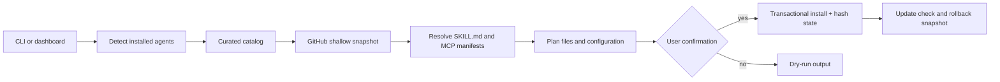

# Loadout

Loadout is a universal upgrade manager for AI coding agents. It discovers, installs,
synchronizes, and updates trusted skills and MCP tools across Claude Code, Codex,
Cursor, Gemini CLI, OpenCode, Hermes, and other compatible agents.

The project is being built for the OpenAI Build Week **Developer Tools** category.

## Status

The first working vertical slice is now implemented: Loadout detects installed agents,
fetches a real public GitHub repository at its current commit, finds its `SKILL.md`
packages, creates a preview plan, installs into agent-specific directories, and records
a rollback snapshot. Nitish's branch also includes a validated shareable manifest,
lockfile generation, safe managed-file removal, drift-aware health reports, tested
profiles, local project recommendations, transactional multi-package sync, applied
updates with risk approval, and an evidence-first improvement proposal command.

See [NITISH_MASTER_PLAN.md](./NITISH_MASTER_PLAN.md) for the expanded implementation
plan and [SIMPLE_PLAN.md](./SIMPLE_PLAN.md) for the short plain-language version. The
original hackathon baseline remains in [MASTER_PLAN.md](./MASTER_PLAN.md).

## Nitish branch commands

```bash
# Create and validate a shareable desired-state file.
node dist/src/cli.js init --name my-team
node dist/src/cli.js sync --manifest loadout.json       # dry run
node dist/src/cli.js sync --manifest loadout.json --yes # apply as one transaction

# Understand and maintain the current setup.
node dist/src/cli.js list
node dist/src/cli.js health
node dist/src/cli.js capabilities
node dist/src/cli.js recommend --project .
node dist/src/cli.js profiles
node dist/src/cli.js improve
node dist/src/cli.js improve --write
node dist/src/cli.js improve-feedback --id <cycle-id> --outcome partial --note "What remains"
node dist/src/cli.js search playwright
node dist/src/cli.js audit --manifest loadout.json --lock loadout.lock

# Create and publish an immutable package to the local registry.
node dist/src/cli.js create ./my-package --name my-package
node dist/src/cli.js pack ./my-package
node dist/src/cli.js publish ./my-package --local
node dist/src/cli.js add my-package --registry my-package@0.1.0

# Safe package lifecycle.
node dist/src/cli.js remove <package-id>                # dry run
node dist/src/cli.js remove <package-id> --yes
node dist/src/cli.js update
node dist/src/cli.js update --package <package-id> --apply
node dist/src/cli.js lock
```

`improve` is deliberately read-only. It selects the next improvement from health
evidence and produces acceptance tests; it never edits, installs, publishes, merges,
or grants permissions autonomously. `--write` stores an owner-only JSON record and
reusable Markdown loop prompt. Human-reviewed success, partial, or failure outcomes can
be recorded locally and are summarized into later cycles; secret-like notes are refused.

MCP packages are configured explicitly in `loadout.json`; Loadout never guesses a
configuration path. A package can select all discovered servers or a named subset:

```json
{
  "id": "docs-mcp",
  "source": { "type": "github", "repository": "owner/docs-mcp" },
  "mcp": {
    "config": "/absolute/path/to/agent-mcp.json",
    "servers": ["docs"]
  }
}
```

`sync --yes` still refuses MCP changes until `--approve-risk` is also provided. MCP
ownership is recorded by fingerprint, health/audit detect drift, removal preserves
unrelated keys and servers, and rollback restores both configuration and Loadout state.

Project or global root files also require explicit scoped exports. Relative source and
target paths cannot escape the package or allowed project/home scope:

```json
"rootFiles": [
  { "source": "AGENTS.md", "target": "AGENTS.md" }
]
```

Claude plugin manifests are detected during inspection. Their skills, rules, commands,
and agents are normalized through the ordinary compatibility planner; Loadout does not
claim that copying a native plugin manifest itself converts plugin-only behavior.

`loadout capabilities` is the source of truth for every agent/component claim. Each
cell is `native`, `adapted`, or `unsupported`; the planner consults the same matrix, so
the documentation cannot quietly claim more than the installer enables. Detection uses
either an executable on `PATH` or an existing agent configuration directory.

## Try the real install path

```bash
npm install
npm run build
node dist/src/cli.js status
node dist/src/cli.js doctor
node dist/src/cli.js catalog
node dist/src/cli.js mcp --repository upstash/context7
node dist/src/cli.js plan --repository obra/superpowers --package obra-superpowers --agents codex
node dist/src/cli.js install --repository obra/superpowers --package obra-superpowers --agents codex --yes
node dist/src/cli.js rollback
```

Repository installs are currently public GitHub repositories only. Loadout clones a
shallow snapshot, records the resolved commit, never runs repository lifecycle scripts,
and copies only discovered `SKILL.md` directories into the selected agent roots.

## Two-minute hackathon demo

This is a live-data demo: the package is fetched from GitHub at the time you run it,
and the catalog can be refreshed from the GitHub API. It does not rely on seeded
install results. The install below uses a disposable profile so a demo cannot alter a
developer's existing agent configuration.

In terminal 1, build and open the local dashboard:

```bash
npm install
npm run build
npm run dashboard
```

Open <http://127.0.0.1:4173>. The page reads the detected agents and the real catalog
from this checkout. It also shows health, updates, local project recommendations,
tested profiles, and locally published registry packages. The dashboard can preview
and apply plans that require no risk override, then undo that exact dashboard change.
Mutations require a private same-origin session token; risky plans remain CLI-only.

In terminal 2, run the story in this order:

```bash
# Keep all demo writes in a temporary home and Loadout state directory.
DEMO_HOME="$(mktemp -d)"
export LOADOUT_USER_HOME="$DEMO_HOME"
export LOADOUT_HOME="$DEMO_HOME/.loadout"

# 1. Detect the agents available on this machine and check prerequisites.
node dist/src/cli.js status
node dist/src/cli.js doctor

# 2. Show the curated, real-repository catalog (refresh is optional but compelling).
node dist/src/cli.js catalog --refresh

# 3. Inspect a real MCP repository without starting its server or running scripts.
node dist/src/cli.js mcp --repository upstash/context7

# 4. Preview, then apply, a real skill package from GitHub.
node dist/src/cli.js plan --repository obra/superpowers --package obra-superpowers --agents codex
node dist/src/cli.js install --repository obra/superpowers --package obra-superpowers --agents codex --yes

# 5. Show commit-aware update status, then demonstrate one-command recovery.
node dist/src/cli.js update
node dist/src/cli.js rollback
```

The narrative is: one catalog replaces repository-hopping; the plan makes every file
change visible; the installer records the exact Git commit; and rollback restores the
previous state. For a presentation, leave the dashboard visible between steps 1 and 2
and show the generated snapshot identifier after step 4.

On Windows PowerShell, use these equivalent setup commands before running the same
`node dist/src/cli.js` commands:

```powershell
$env:LOADOUT_USER_HOME = Join-Path $env:TEMP ("loadout-demo-" + [guid]::NewGuid())
$env:LOADOUT_HOME = Join-Path $env:LOADOUT_USER_HOME ".loadout"
New-Item -ItemType Directory -Force $env:LOADOUT_USER_HOME | Out-Null
```

## How it works



Discovery and planning are read-only. Installation writes only the selected package's
managed directories, and the current implementation never executes third-party
repository lifecycle scripts. The loopback API and dashboard expose status, health,
catalog, updates, recommendations, and authenticated safe sync/rollback actions.

## Current demo boundaries

- Public GitHub repositories are supported; private-repository OAuth is planned.
- The install path currently handles skill directories containing `SKILL.md`.
- MCP manifests can be inspected and MCP JSON configuration changes can be planned or
  applied, but MCP processes are not launched by Loadout.
- The catalog is curated rather than an index of every repository on the internet.
- Updates are reported and installs are transactional; autonomous background updates
  and signed catalog releases are not yet enabled.
- The manifest currently resolves catalog, public GitHub refs/subpaths, generic HTTPS
  or SSH Git sources, and local sources. Package dependencies are ordered and missing,
  disabled, or cyclic dependencies are rejected. Skills, conventional rule directories,
  command directories, and agent directories are normalized; unsupported targets are
  skipped rather than falsely converted. Plugin/root-file application, automated MCP
  targeting for non-JSON agent formats, native plugin-only behavior, transitive package-owned manifests, remote authentication, and a hosted
  publishing registry remain planned. The implemented local registry is immutable,
  digest-verified, searchable, and risk-gated, but it is not presented as hosted.

## Core promise

Run one command, let Loadout detect the agents on your computer, and choose either a
stable or maximum universal boost. Loadout handles platform-specific installation,
keeps a record of every change, and can roll back to the last working configuration.
