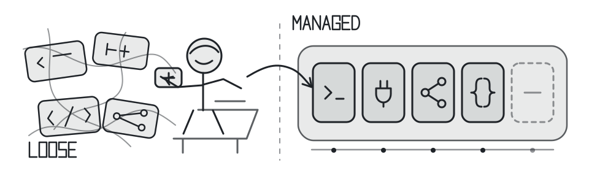

<p align="center">
  
</p>

<h1 align="center">Loadout</h1>

<p align="center"><strong>Agent extensions, under control.</strong></p>

<p align="center">
  A local CLI for inspecting, previewing, installing, and undoing managed extensions for AI coding agents.
</p>

<p align="center">
  <a href="https://github.com/VirajMishra1/loadout/actions/workflows/ci.yml"></a>
  <a href="./package.json"></a>
  <a href="./LICENSE"></a>
</p>

<p align="center">
  <a href="#how-it-works">How it works</a> ·
  <a href="#install-from-source">Install</a> ·
  <a href="#profiles">Profiles</a> ·
  <a href="#trust-and-limits">Trust</a> ·
  <a href="#command-reference">Commands</a> ·
  <a href="#development">Development</a>
</p>

> [!IMPORTANT]
> `npm install --global loadout-ai@0.3.2` is not currently published and is unavailable. Use an authorized source checkout; the npm registry check on 2026-07-19 exposed versions only through `0.3.1`.

## How it works

**Choose -> Inspect -> Preview -> Apply -> Undo**

1. **Choose** a bounded profile or explicit packages.
2. **Inspect** pinned source and catalog metadata separately before setup.
3. **Preview** detected agents, aggregate repository, directory, and collision counts, warnings, skipped entries, and package IDs needing approval without changing agent target files.
4. **Apply** by rerunning with `--yes`; Loadout recomputes from current state before using a snapshot-backed transaction.
5. **Undo** the latest supported mutation with drift checks that protect later edits.

### Abridged terminal transcript

This is an explicitly abridged transcript from a disposable, single-Codex Stable run. A literal `…` marks omitted fetch output; `<snapshot-id>` is a variable placeholder because snapshot IDs vary.

```console
$ loadout setup --mode stable --agents codex
…
Loadout: Stable Boost
Detected agents: Codex
Catalog selection: 4 repositories
Ready to install: 4 skill repositories (30 agent skill directories)
Preview complete; nothing was changed. Re-run with --yes to install this exact screened plan.

$ loadout setup --mode stable --agents codex --yes
…
Loadout installed 4 repositories for 1 agent(s). Snapshot: <snapshot-id>

$ loadout rollback
Restored snapshot <snapshot-id>
```

The final preview sentence above is captured CLI wording. A later `--yes` invocation recomputes the plan from pinned sources and current agent and filesystem state; it does not persist or prove identity with the earlier preview.

Preview may populate Loadout's own cache; it leaves agent target files unchanged. Review its aggregate counts, warnings, skipped entries, and package IDs needing approval before deciding whether to run a later apply command.

## Why Loadout

Loadout is the deliberate set of tools chosen before a mission: skills, plugins, MCP servers, and agent settings. It makes it clear what is installed, where it came from, or how to undo it.

- **One managed inventory.** List installed packages, inspect drift, and track what Loadout owns across configured agent paths.
- **Preview by default.** Setup, updates, removal, MCP recipes, and uninstall expose a plan before their supported writes.
- **Recoverable changes.** Snapshots and managed-file hashes support rollback while refusing to overwrite later user edits.

## Install from source

You need Node.js 20 or newer, Git, and access to this private repository.

```bash
git clone https://github.com/VirajMishra1/loadout.git
cd loadout
npm ci
npm run build
npm link
loadout --version
```

For a disposable first success, run:

```bash
loadout demo
```

The demo uses temporary state and cleans it up; it does not write to your normal agent configuration. See the [user test guide](./docs/USER_TEST_GUIDE.md) if linking, `PATH`, networking, risk approval, or rollback needs attention.

## Stable workflow

```bash
# Preview for detected agents
loadout setup --mode stable

# Recompute from current state and apply after reviewing the preview
loadout setup --mode stable --yes

# Inspect managed state, then undo the latest supported mutation
loadout list
loadout health --explain
loadout rollback
```

Stable currently selects 30 skill directories from four pinned, SPDX-identified, policy-selected public sources. Selection policy is evidence, not a claim that the sources are safe, trusted, human-reviewed, benchmarked, or the right choice for every user.

## Profiles

| Profile     | Scope                                                                  |
| ----------- | ---------------------------------------------------------------------- |
| **Stable**  | Bounded default: 30 skills from four policy-selected sources           |
| **Power**   | Broader cross-project set from eight checked-in collections            |
| **Maximum** | Valid skill-bearing contents in a managed, disabled-by-default library |
| **Custom**  | Only package IDs explicitly supplied by the user                       |

Preview choices with `loadout profiles` and `loadout setup --mode <profile>`. Maximum counts are computed from pinned contents after validation and duplicate resolution; MCP-only entries stay on a separate approval path.

## Catalog and discovery

<!-- loadout:catalog-coverage:start -->

The bundled catalog currently contains **50 credited public repositories** across **37 categories**: **31 have skill components** and **19 are MCP-only**. All 50 are technically screened and pinned; 4 sources are selected by the bounded Stable policy. See every linked source, license status, component type, and pinned commit in **[Catalog and upstream credits](./docs/CATALOG.md)**.

<!-- loadout:catalog-coverage:end -->

<!-- loadout:evidence-stages:start -->

Catalog evidence-stage counts: **0 benchmarked**, **0 discovered**, **0 human-reviewed**, **46 inspected**, **4 policy-selected**. Stage definitions and Stable selection criteria are in the [catalog policy](./docs/CATALOG_POLICY.md).

<!-- loadout:evidence-stages:end -->

Loadout does not claim there is one universally “best” configuration. Recommendations are bounded, rule-based proposals; stars and discovery results are signals for review, not quality proof.

<!-- loadout:daily-discovery:start -->

**Discovery snapshot (generated 2026-07-17):** [242 repositories observed](./docs/DISCOVERED.md), including 219 uncataloged review candidates and 23 repositories already in the inspected catalog.
<!-- loadout:daily-discovery:end -->

The checked-in discovery report proves only its dated snapshot, not the success of every scheduled run. Use `loadout discover --source all --queue`, `loadout review-queue`, and `loadout candidate inspect owner/repository` to inspect candidates before catalog promotion.

## Trust and limits

- A pinned commit identifies source bytes; it does not prove safety, correct licensing, usefulness, or future compatibility.
- Static inspection reports scripts, hooks, binaries, domains, credential references, and unsupported components. It is not a security audit.
- No bundled source is called benchmarked until isolated real trials, signed evidence, and human approval exist.
- Project recommendations read bounded local metadata. The documented local flow does not upload project source.
- Catalog fetches, discovery, update checks, and optional live checks use the network where stated.
- MCP servers and executable tools have separate preview and approval paths because they can use credentials, start processes, or contact services.
- Shared manifests hold environment-variable or OS-keychain references, not secret values.

<!-- loadout:current-limits:start -->

- **6 catalog records** currently have `NOASSERTION` license status and need upstream-license review before a public release decision.

<!-- loadout:current-limits:end -->

Read the [security policy](./SECURITY.md), [catalog policy](./docs/CATALOG_POLICY.md), and [credential and update policy](./docs/CREDENTIAL_AND_UPDATE_POLICY.md) before trusting third-party content.

## Agent support

<!-- loadout:support-summary:start -->

Loadout's adapter capability matrix currently covers **12 agents**: Claude Code, Cline, Codex, Cursor, Gemini CLI, GitHub Copilot, Hermes, Junie, Kiro CLI, OpenCode, Roo Code, Windsurf. See the [complete feature matrix](./docs/FEATURE_TEST_MATRIX.md) for configured paths, filesystem lifecycle, platform, and native-host evidence.

`tests/adapter-conformance.test.ts` plans, applies, inspects, disables, re-enables, and rolls back one skill for every configured target when the suite runs. A configured target path does not prove that the native application recognizes or executes it. Native application execution is not inferred from filesystem simulation.

Configured platform evidence: Linux (CI configured), macOS (CI configured), Windows (CI configured).

Platform evidence source: `.github/workflows/ci.yml (cross-platform job)`.

Configured CI platforms describe a manually triggered workflow, not evidence that a current run passed.

<!-- loadout:support-summary:end -->

Configured paths and disposable filesystem lifecycle tests do not prove that native applications recognize or execute installed skills. Use `loadout capabilities --inspect` for the local component matrix.

## Command reference

| Job                                | Command                                     |
| ---------------------------------- | ------------------------------------------- |
| Guided read-only path              | `loadout guide`                             |
| Preview or apply a profile         | `loadout setup --mode stable [--yes]`       |
| List and inspect managed state     | `loadout list`; `loadout health --explain`  |
| Browse or search                   | `loadout catalog`; `loadout search <words>` |
| Recommend for a project            | `loadout recommend --project .`             |
| Preview or apply updates           | `loadout update [--yes]`                    |
| Undo the latest supported mutation | `loadout rollback`                          |
| Remove one managed package         | `loadout remove <package>`                  |
| Preview complete removal           | `loadout uninstall`                         |
| Test with temporary state          | `loadout demo`                              |
| Discover the full surface          | `loadout --help`; `loadout advanced`        |

## Development

```bash
npm ci
npm run verify
npm run verify:full
```

<!-- loadout:verification-summary:start -->

`verify` invokes `format:check`, `lint`, `typecheck`, `check:evidence`, `test`, `test:e2e:cli`, `test:e2e:readme`, `test:package`, `test:performance` in that order. Use `npm run verify:full` to include the optional Playwright dashboard check.

<!-- loadout:verification-summary:end -->

The repository's mixed README product-flow test uses an isolated build, disposable state, an offline fixture, direct core calls, and CLI subprocesses. It does not prove live-network availability or behavior inside native agent applications. The [testing guide](./docs/TESTING.md) documents the exact checks and their boundaries.

## Documentation

- [Catalog and upstream credits](./docs/CATALOG.md)
- [Catalog evidence policy](./docs/CATALOG_POLICY.md)
- [Feature and evidence matrix](./docs/FEATURE_TEST_MATRIX.md)
- [Testing contract](./docs/TESTING.md)
- [User test and troubleshooting guide](./docs/USER_TEST_GUIDE.md)
- [Daily discovery snapshot](./docs/DISCOVERED.md)
- [Candidate inspection and promotion](./docs/CANDIDATE_INTELLIGENCE.md)
- [Credential and update policy](./docs/CREDENTIAL_AND_UPDATE_POLICY.md)
- [Repository stabilization record](./docs/REPOSITORY_STABILIZATION.md)
- [Engineering plan](./MASTER_PLAN.md) and [changelog](./CHANGELOG.md)

## Contributing, security, and attribution

Keep changes scoped, add regression coverage for behavior changes, and run `npm run verify:full`. Report vulnerabilities through [SECURITY.md](./SECURITY.md), without credentials, private source, or unredacted state. General bugs and proposals belong in the [issue tracker](https://github.com/VirajMishra1/loadout/issues).

The catalog contains 50 credited public repositories. Inclusion records discovery and attribution; it does not transfer ownership, imply endorsement, or relicense upstream work.

## License

Loadout is licensed under the [MIT License](./LICENSE). Catalog entries retain their upstream licenses and terms.
