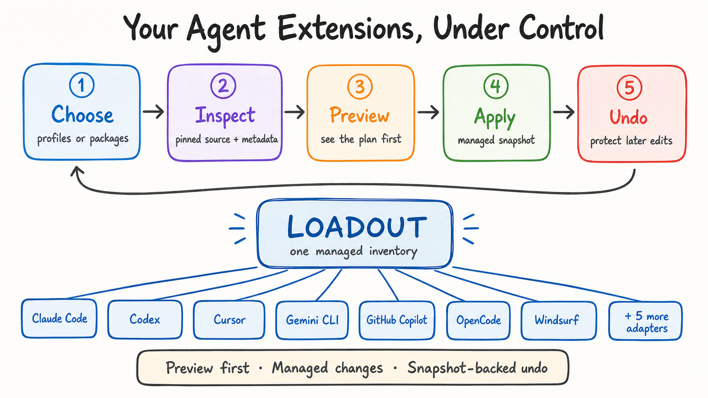

<p align="center">
  
</p>

<h1 align="center">Loadout</h1>

<p align="center"><strong>Agent extensions, under control.</strong></p>

<p align="center">
  <strong>The package manager for your AI coding setup.</strong><br>
  Discover broadly. Activate the right tools for each project. Stay current without starting over.
</p>

<p align="center">
  <a href="https://github.com/VirajMishra1/loadout/actions/workflows/ci.yml"></a>
  <a href="https://www.npmjs.com/package/loadout-ai"></a>
  <a href="https://www.npmjs.com/package/loadout-ai"></a>
  <a href="https://github.com/VirajMishra1/loadout"></a>
  <a href="./package.json"></a>
  <a href="./LICENSE"></a>
</p>

<p align="center">
  <a href="#install">Install</a> ·
  <a href="#why-loadout">Why Loadout</a> ·
  <a href="#profiles">Profiles</a> ·
  <a href="#catalog-and-discovery">Discover</a> ·
  <a href="#trust-and-limits">Trust</a> ·
  <a href="#command-reference">Commands</a>
</p>

## Install

You need Node.js 20 or newer and Git.

```bash
npm install --global loadout-ai@0.5.9
loadout setup --mode stable
```

The second command detects your agents and previews the 30-skill Stable loadout.
Nothing changes until you approve it. If anything goes wrong, start with the
[user test guide](./docs/USER_TEST_GUIDE.md).

## How it works

**Choose -> Inspect -> Preview -> Apply -> Undo**

1. **Choose** Stable, Power, Maximum, or your own package list.
2. **Inspect** where each extension comes from and what it can do.
3. **Preview** every planned change without changing agent files.
4. **Apply** with `--yes`; Loadout saves a rollback snapshot first.
5. **Undo** with `loadout rollback` if you change your mind.

### Abridged terminal transcript

This is an explicitly abridged transcript from a disposable, single-Codex Stable run. A literal `…` marks omitted fetch output; `<snapshot-id>` is a variable placeholder because snapshot IDs vary.

```console
$ loadout setup --mode stable --agents codex
…
Loadout: Stable Boost
Detected agents: Codex
Catalog selection: 4 repositories
Ready to install: 4 skill repositories (30 agent skill directories)
Preview complete; nothing was changed. Re-run with --yes to install this exact screened plan.

$ loadout setup --mode stable --agents codex --yes
…
Loadout installed 4 repositories for 1 agent(s). Snapshot: <snapshot-id>

$ loadout rollback
Restored snapshot <snapshot-id>
```

The final preview sentence above is captured CLI wording. A later `--yes` invocation recomputes the plan from pinned sources and current agent and filesystem state; it does not persist or prove identity with the earlier preview.

Preview may fill Loadout's private download cache, but it does not change your agent
files. Review the summary and warnings before approving an apply command.

## Why Loadout

Loadout started with a frustrating question: **why does improving an AI coding agent
still mean opening twenty GitHub tabs?**

Useful skills, plugins, MCP servers, and settings arrive one experiment at a time.
Soon it is hard to remember what is installed, where it came from, whether something
better launched yesterday, or how to undo a change. The name comes from games, where
your loadout is the set of tools you choose for the mission. This does the same for AI
coding agents without making you rebuild the setup for every agent and every project.

Most extension tools begin with a repo you already know. Loadout begins one step
earlier: **what is actually worth knowing?** It stays with you after installation.

Loadout watches a much wider catalog than it activates. You can keep thousands of
technically screened skill copies in the disabled Maximum library, discover new projects as
they appear, and let each codebase pull a focused active set instead of dumping
everything into every prompt.

| The usual workflow                                             | The Loadout workflow                                             |
| -------------------------------------------------------------- | ---------------------------------------------------------------- |
| Find recommendations across feeds and bookmarks                | Watch one growing discovery catalog                              |
| Open every repo and guess whether to trust it                  | Inspect pinned sources, licenses, components, and risk findings  |
| Copy skills separately into Claude, Codex, Cursor, and friends | Apply one reviewed selection across detected agents              |
| Let every skill compete for context forever                    | Keep a bounded daily set or activate skills for this project     |
| Hope updates do not break anything                             | Preview updates and protect every managed change with a snapshot |
| Manually remember what was changed                             | Scan, reconcile, remove, roll back, or completely uninstall      |

Loadout is local, open source, and preview-first. It does not need an OpenAI or
Anthropic API key to manage skills. MCP servers and executable tools stay behind
their own explicit setup and permission steps.

### Demo

<p align="center">
  <a href="https://www.youtube.com/watch?v=opNqJKX7xMw">
    
  </a>
</p>

**[Watch the 72-second Loadout demo on YouTube](https://www.youtube.com/watch?v=opNqJKX7xMw).**
It shows the real CLI product, including profiles, project-aware selection,
discovery, explicit integrations, and snapshot-backed rollback. The exact
[recording and voiceover script](./docs/DEMO_SCRIPT.md) is public.

The [end-to-end acceptance guide](./docs/USER_TEST_GUIDE.md) contains the commands
you can run yourself.

## Stable workflow

### Stable Boost: install the essentials and start building

Stable is the recommended daily driver: **30 selected skill directories from four
pinned public sources**, installed into each agent you choose. It covers planning,
implementation, debugging, testing, documentation, code review, frontend work,
performance, Git, shipping, and more without turning every discovered skill on.

| Included source                                                        | What Stable takes from it                                     | GitHub                                                                                                                                            |
| ---------------------------------------------------------------------- | ------------------------------------------------------------- | ------------------------------------------------------------------------------------------------------------------------------------------------- |
| [Superpowers](https://github.com/obra/superpowers)                     | Planning, execution, testing, review, verification            | [](https://github.com/obra/superpowers)               |
| [Context7](https://github.com/upstash/context7)                        | Current documentation and MCP workflows                       | [](https://github.com/upstash/context7)               |
| [Addy Osmani Agent Skills](https://github.com/addyosmani/agent-skills) | Engineering, frontend, debugging, performance, docs, shipping | [](https://github.com/addyosmani/agent-skills) |
| [Agent Skills Marketplace](https://github.com/wshobson/agents)         | Architecture, review, error handling, JavaScript, Python      | [](https://github.com/wshobson/agents)                 |

Every row links directly to the upstream project. Loadout does not claim ownership
or endorsement; it pins, credits, screens, and selects from their public work.

```bash
# Preview for detected agents
loadout setup --mode stable

# Recompute from current state and apply after reviewing the preview
loadout setup --mode stable --yes

# Inspect managed state, then undo the install if needed
loadout status
loadout scan
loadout rollback
```

Stable is Loadout's strongest general starting point, not a claim that one setup is
best for every person or project. Run `loadout profiles stable --json` when you want
the machine-readable selection.

## Manage skills you already have

Already have skills? Loadout can compare them with exact catalog copies and manage
the ones it can identify confidently:

```bash
# Read-only inventory and source/update comparison
loadout scan
loadout reconcile --refresh

# Record ownership only for exact byte-for-byte matches; files are not rewritten
loadout reconcile --yes

# Preview old copies that have one unambiguous reviewed source
loadout reconcile --replace-outdated
```

Unknown or ambiguous copies stay untouched. Replacing an old copy is a separate,
previewed transaction with its own rollback snapshot. Managed copies can then be
checked by `loadout update` without moving them to a different agent path.

## Profiles

Loadout is opinionated when you want it to be and precise when you do not.

### Power Boost: a larger cross-project toolkit

Power draws a skill-level allowlist from eight major collections. The prepared set
is deduplicated and invalid units are quarantined, so the final count can be lower
than the raw allowlist. In current acceptance testing it prepared about 50 active
skills per agent.

| Included source                                                          | Focus                                                     | GitHub                                                                                                                                                                      |
| ------------------------------------------------------------------------ | --------------------------------------------------------- | --------------------------------------------------------------------------------------------------------------------------------------------------------------------------- |
| [Anthropic Skills](https://github.com/anthropics/skills)                 | Documents, frontend, MCP building, web testing            | [](https://github.com/anthropics/skills)                                       |
| [OpenAI Skills](https://github.com/openai/skills)                        | CLI, docs, browser work, images, security                 | [](https://github.com/openai/skills)                                               |
| [Vercel Agent Skills](https://github.com/vercel-labs/agent-skills)       | React, web design, composition, deployment                | [](https://github.com/vercel-labs/agent-skills)                         |
| [Superpowers](https://github.com/obra/superpowers)                       | Planning, debugging, testing, collaboration               | [](https://github.com/obra/superpowers)                                         |
| [UI UX Pro Max](https://github.com/nextlevelbuilder/ui-ux-pro-max-skill) | UI systems, slides, styling, product design               | [](https://github.com/nextlevelbuilder/ui-ux-pro-max-skill) |
| [Context7](https://github.com/upstash/context7)                          | Current documentation and MCP workflows                   | [](https://github.com/upstash/context7)                                         |
| [Agent Skills Marketplace](https://github.com/wshobson/agents)           | Architecture, testing, APIs, TypeScript, Python           | [](https://github.com/wshobson/agents)                                           |
| [Awesome Copilot](https://github.com/github/awesome-copilot)             | Codebase knowledge, plans, browser and security workflows | [](https://github.com/github/awesome-copilot)                             |

```bash
loadout setup --mode power
```

### Maximum Library: download broadly, activate intelligently

Maximum is for explorers. It downloads every non-archived, technically screened
skill component in the catalog into Loadout's **disabled local library**. Disabled
means cached and available, not injected into agent context. Then let the current
project choose a focused active set:

```bash
loadout setup --mode maximum
loadout recommend --project . --agent codex
loadout optimize --project . --agents codex,claude-code --limit 30
loadout optimize --project . --agents codex,claude-code --limit 30 --yes
```

This is the difference between “install everything” and “have everything ready.”
The first overloads agents; the second gives you a large library with a small,
relevant active loadout.

### Custom: take exact control

Use `setup` when the listed packages should become the complete managed profile for
the selected agents. Packages from the previous managed profile that are not listed
will be retired, and the preview names every retirement:

```bash
loadout setup --mode custom --package superpowers --package context7
```

Use `install` when you only want to add a package without replacing the current
managed profile:

```bash

# Install the reviewed Humanizer writing skill into Codex
loadout install --mode custom --package humanizer --agents codex

# Install the reviewed Obsidian skills explicitly
loadout install --mode custom --package obsidian-skills --agents codex,claude-code
```

Run `loadout profiles` to compare every mode. MCP servers always use a separate
approval step. Obsidian skills are also proposed automatically when `recommend` or
`optimize` detects an Obsidian vault; they are not added to the universal Stable set.

## MCP integrations

Profiles never start MCP servers silently. First list the available recipes and see
which ones need credentials:

```bash
loadout mcp-recipe
loadout mcp-recipe --credential-free
```

Preview and configure one for the host you use:

```bash
loadout mcp-recipe playwright --agent codex
loadout mcp-recipe playwright --agent codex --yes
loadout mcp-recipe playwright --agent codex --verify

loadout mcp-recipe playwright --agent claude-code
loadout mcp-recipe playwright --agent claude-code --yes
```

Configuration alone does not start the server. Test a real connection separately
with `--connect --approve-risk`. Loadout can reference credentials from environment
variables or the OS keychain without printing their values.

## Optional runtime tools

[Graphify](https://github.com/Graphify-Labs/graphify) is an optional codebase graph
tool. It installs both a command and an agent skill, so Loadout keeps it separate from
the normal profiles. It does not require an OpenAI or Anthropic API key:

```bash
loadout tool graphify --agents codex,claude-code
loadout tool graphify --agents codex,claude-code --yes --approve-risk
loadout tool graphify --remove --agents codex,claude-code --yes --approve-risk
```

Executable tools remain an explicit choice instead of hiding inside a profile.

## Catalog and discovery

### GitHub moves every day. Your loadout should not stand still.

The catalog is not a frozen “top 50” list. Loadout separates **discovery** from
**installation** so a viral repo can be noticed quickly without being trusted
blindly. Candidates enter a review queue; catalog entries are pinned and inspected;
only the bounded Stable policy gets the strongest automatic recommendation.

```bash
# Find candidates across configured discovery sources
loadout discover --source all --queue

# Inspect the queue and one candidate before promotion
loadout review-queue
loadout candidate inspect owner/repository

# Check whether managed active or disabled-library sources changed
loadout update
loadout health --updates
```

Daily checks are opt-in and read-only. They tell you what changed; they do not
silently rewrite your agents:

```bash
loadout autopilot --yes
loadout autopilot --status
```

<!-- loadout:catalog-coverage:start -->

The bundled catalog currently contains **53 credited public repositories** across **39 categories**: **34 have skill components** and **19 are MCP-only**. All 53 are technically screened and pinned; 4 sources are selected by the bounded Stable policy. See every linked source, license status, component type, and pinned commit in **[Catalog and upstream credits](./docs/CATALOG.md)**.

<!-- loadout:catalog-coverage:end -->

<!-- loadout:evidence-stages:start -->

Catalog maturity: **53 sourced**, **53 technically inspected**, and **4 selected for Stable**. Independent human-review attestations and signed comparative benchmarks are not yet published, so Loadout does not pretend static inspection proves usefulness. The pinned catalog remains usable today, and local outcomes can be recorded to improve later rankings. Definitions and promotion rules are in the [catalog policy](./docs/CATALOG_POLICY.md).

<!-- loadout:evidence-stages:end -->

Loadout does not claim there is one universally “best” configuration. Recommendations are bounded, rule-based proposals; stars and discovery results are signals for review, not quality proof.

<!-- loadout:daily-discovery:start -->

**Discovery snapshot (generated 2026-07-23):** [241 repositories observed](./docs/DISCOVERED.md), including 216 uncataloged review candidates and 25 repositories already in the inspected catalog.
<!-- loadout:daily-discovery:end -->

The checked-in discovery report proves only its dated snapshot, not the success of every scheduled run. Use `loadout discover --source all --queue`, `loadout review-queue`, and `loadout candidate inspect owner/repository` to inspect candidates before catalog promotion.

## Trust and limits

- A pinned commit identifies source bytes; it does not prove safety, correct licensing, usefulness, or future compatibility.
- Static inspection reports scripts, hooks, binaries, domains, credential references, and unsupported components. It is not a security audit.
- No bundled source is called benchmarked until isolated real trials, signed evidence, and human approval exist.
- Project recommendations read bounded local metadata. The documented local flow does not upload project source.
- Catalog fetches, discovery, update checks, and optional live checks use the network where stated.
- MCP servers and executable tools have separate preview and approval paths because they can use credentials, start processes, or contact services.
- Shared manifests hold environment-variable or OS-keychain references, not secret values.

<!-- loadout:current-limits:start -->

- **6 catalog records** currently have `NOASSERTION` license status and need upstream-license review before a public release decision.

<!-- loadout:current-limits:end -->

The six records have an explicit public-release decision rather than an assumed
license. Read [Upstream license decisions](./docs/UPSTREAM_LICENSE_DECISIONS.md) for
the source-by-source record and the boundary applied to Power, Maximum, and Custom.

Read the [security policy](./SECURITY.md), [catalog policy](./docs/CATALOG_POLICY.md), and [credential and update policy](./docs/CREDENTIAL_AND_UPDATE_POLICY.md) before trusting third-party content.

## Agent support

<!-- loadout:support-summary:start -->

Loadout's adapter capability matrix currently covers **12 agents**: Claude Code, Cline, Codex, Cursor, Gemini CLI, GitHub Copilot, Hermes, Junie, Kiro CLI, OpenCode, Roo Code, Windsurf. See the [complete feature matrix](./docs/FEATURE_TEST_MATRIX.md) for configured paths, filesystem lifecycle, platform, and native-host evidence.

`tests/adapter-conformance.test.ts` plans, applies, inspects, disables, re-enables, and rolls back one skill for every configured target when the suite runs. A configured target path does not prove that the native application recognizes or executes it. Native application execution is not inferred from filesystem simulation.

Configured platform evidence: Linux (CI configured), macOS (CI configured), Windows (CI configured).

Platform evidence source: `.github/workflows/ci.yml (cross-platform job)`.

Configured CI platforms describe a manually triggered workflow, not evidence that a current run passed.

<!-- loadout:support-summary:end -->

Configured paths and disposable filesystem lifecycle tests do not prove that native applications recognize or execute installed skills. Use `loadout capabilities --inspect` for the local component matrix.

## Command reference

Start at the top and stop whenever Loadout does everything you need.

| Priority | What it does                                                    | Command                                                            |
| -------: | --------------------------------------------------------------- | ------------------------------------------------------------------ |
|        1 | Opens the beginner-friendly guided path                         | `loadout guide`                                                    |
|        2 | Previews the recommended 30-skill daily setup                   | `loadout setup --mode stable`                                      |
|        3 | Previews the broader Power setup                                | `loadout setup --mode power`                                       |
|        4 | Downloads the broad screened library, disabled by default       | `loadout setup --mode maximum`                                     |
|        5 | Shows Loadout-managed packages and active skills                | `loadout status`; `loadout library`                                |
|        6 | Inventories skills across detected agents without changing them | `loadout scan`                                                     |
|        7 | Explains what fits the current repository                       | `loadout recommend --project . --agent codex`                      |
|        8 | Previews a bounded project-specific active set                  | `loadout optimize --project . --limit 30`                          |
|        9 | Compares existing skills with reviewed catalog copies           | `loadout reconcile --refresh`                                      |
|       10 | Checks managed active and disabled-library sources for changes  | `loadout update`                                                   |
|       11 | Finds newly launched or newly popular candidates                | `loadout discover --source all --queue`                            |
|       12 | Shows candidates waiting for deeper review                      | `loadout review-queue`                                             |
|       13 | Lists MCP recipes and credential needs                          | `loadout mcp-recipe`; `loadout mcp-recipe --credential-free`       |
|       14 | Previews an MCP configuration                                   | `loadout mcp-recipe playwright --agent codex`                      |
|       15 | Lists and installs isolated runtime tools such as Graphify      | `loadout tool`; `loadout tool graphify --agents codex,claude-code` |
|       16 | Lists snapshots or restores the latest managed change           | `loadout rollback --list`; `loadout rollback`                      |
|       17 | Previews removal of one managed package                         | `loadout remove <package-id>`                                      |
|       18 | Previews complete removal of Loadout-managed state              | `loadout uninstall`                                                |
|       19 | Enables read-only daily discovery and update checks             | `loadout autopilot --yes`                                          |
|       20 | Shows the complete CLI                                          | `loadout --help`; `loadout advanced`                               |

Most mutating commands are dry runs first. After reading the preview, add `--yes` to
apply. Commands with executable or connection risk require the additional approval
shown in their output.

## Built with Codex and GPT-5.6

Loadout was built during OpenAI Build Week by a three-person team working with Codex
and GPT-5.6. Codex was not a chat box bolted onto the finished project. It was the
engineering environment we used to plan, build, test, and repeatedly challenge the
product while it was taking shape.

### From a broad idea to a working product

The starting idea was simple: one install that gives every coding agent the best
extensions on GitHub. The difficult part was everything hidden inside that sentence.
What counts as “best”? How much should stay active? What happens to skills a user
already has? How do you update a repository without silently trusting new code? How
do you undo changes across several agents?

We used GPT-5.6 through Codex for the repo-wide reasoning behind those decisions.
Together, we turned the idea into three distinct modes: a bounded Stable daily
driver, a larger Power setup, and a Maximum library that keeps broad optionality
without loading thousands of skills into every prompt.

| Part of the build  | How we used Codex and GPT-5.6                                                                                                | What made it into Loadout                                                                                   |
| ------------------ | ---------------------------------------------------------------------------------------------------------------------------- | ----------------------------------------------------------------------------------------------------------- |
| Product planning   | Broke the original idea into testable user journeys and challenged unsafe assumptions                                        | Stable, Power, Maximum, Custom, project optimization, discovery, updates, and complete uninstall            |
| Architecture       | Traced how catalogs, adapters, agent directories, manifests, and snapshots affect one another                                | A local TypeScript CLI with a shared catalog, 12 agent adapters, and snapshot-backed transactions           |
| Ecosystem research | Compared repositories, checked source layouts and licenses, and separated popularity from evidence                           | 53 pinned catalog sources plus a discovery snapshot watching 240 repositories                               |
| Implementation     | Wrote and refactored CLI commands, schemas, source fetchers, installers, active-set logic, and MCP configuration             | The published `loadout-ai` package and the commands documented above                                        |
| Safety work        | Looked for scripts, hooks, binaries, credential references, target collisions, stale previews, and external edits            | Preview-first changes, quarantined skill units, explicit risk approval, drift protection, and rollback      |
| Testing            | Generated adversarial cases, reproduced failures from real terminal sessions, and converted them into regression tests       | 632 passing tests, CLI and README end-to-end flows, package smoke tests, and a 1,000-skill performance gate |
| Team integration   | Audited teammate branches, compared them with `main`, prepared focused pull requests, and checked what was actually complete | One public history instead of three disconnected prototypes                                                 |
| Release work       | Verified npm contents, version behavior, GitHub metadata, documentation claims, and public CI                                | A public npm package, credited upstream catalog, release evidence, and a reproducible verification command  |

### Real testing changed the code

Codex was most useful when the neat plan met a messy laptop. A few examples:

- A Graphify install appeared in Claude Code but vanished from Codex inventory
  because the generated runtime skill and the normal skill scanner used different
  Codex paths. The scan now recognizes managed runtime-tool skills explicitly.
- Update checks repeatedly timed out on large repositories. We measured the real
  clone cost, changed the update path to check remote commit metadata first, and only
  fetch a full snapshot when a pinned source actually changed.
- Existing unmanaged skills could occupy the same target as a Stable install.
  Instead of overwriting them, Loadout now stops, scans, compares, and offers a
  separate reconciliation path for exact or unambiguous matches.
- ChatGPT and Claude subscriptions were easy to confuse with separately billed API
  access. Setup now asks about API access explicitly, while credentialed MCP servers
  remain separate from automatic skill installation.

Those fixes came from a loop we repeated throughout the week: run the real command,
paste the exact output into Codex, trace the behavior through the codebase, write a
regression test, fix the smallest responsible layer, and run the full release gate.

### What the team owned

The humans chose the product direction, selected the tradeoffs, reviewed upstream
projects, tested Loadout on real Codex and Claude Code profiles, approved risky
operations, and made every release decision. GPT-5.6 helped with high-context design,
debugging, and review; Codex handled the implementation loop and verification tools.
Neither replaced human judgment about what should be installed on someone else's
machine.

Loadout itself does **not** call GPT-5.6 and does not require an OpenAI API key to
manage skills. Codex and GPT-5.6 helped build the tool; they are not a hidden runtime
dependency.

## Development

```bash
npm ci
npm run verify
npm run verify:full
```

<!-- loadout:verification-summary:start -->

`verify` invokes `format:check`, `lint`, `typecheck`, `check:evidence`, `test`, `test:e2e:cli`, `test:e2e:readme`, `test:package`, `test:performance` in that order. `npm run verify:full` is an alias for the same complete CLI release gate.

<!-- loadout:verification-summary:end -->

The repository's mixed README product-flow test uses an isolated build, disposable state, an offline fixture, direct core calls, and CLI subprocesses. It does not prove live-network availability or behavior inside native agent applications. The [testing guide](./docs/TESTING.md) documents the exact checks and their boundaries.

## Documentation

- [Catalog and upstream credits](./docs/CATALOG.md)
- [Catalog evidence policy](./docs/CATALOG_POLICY.md)
- [Feature and evidence matrix](./docs/FEATURE_TEST_MATRIX.md)
- [Testing contract](./docs/TESTING.md)
- [User test and troubleshooting guide](./docs/USER_TEST_GUIDE.md)
- [Daily discovery snapshot](./docs/DISCOVERED.md)
- [Candidate inspection and promotion](./docs/CANDIDATE_INTELLIGENCE.md)
- [Credential and update policy](./docs/CREDENTIAL_AND_UPDATE_POLICY.md)
- [Upstream license decisions](./docs/UPSTREAM_LICENSE_DECISIONS.md)
- [Changelog](./CHANGELOG.md)

## Contributing, security, and attribution

Keep changes scoped, add regression coverage for behavior changes, and run `npm run verify:full`. Report vulnerabilities through [SECURITY.md](./SECURITY.md), without credentials, private source, or unredacted state. General bugs and proposals belong in the [issue tracker](https://github.com/VirajMishra1/loadout/issues).

The catalog contains 53 credited public repositories. Inclusion records discovery and attribution; it does not transfer ownership, imply endorsement, or relicense upstream work.

## License

Loadout is licensed under the [MIT License](./LICENSE). Catalog entries retain their upstream licenses and terms.
