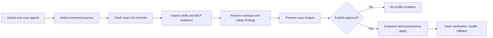

# Loadout

**One safe CLI to discover, compare, install, update, and roll back capabilities across AI coding agents.**

Loadout turns the fragmented world of Agent Skills, MCP servers, plugins, and agent-specific directories into one screened workflow. It detects the agents on your computer, inventories what you already have, prepares capabilities from immutable Git commits, explains conflicts before writing, and snapshots every managed change.

It supports Codex, Claude Code, Cursor, Gemini CLI, OpenCode, Hermes, Windsurf, Cline, GitHub Copilot, Roo Code, Kiro CLI, and Junie on macOS, Linux, and Windows.

> Loadout is available as a public npm beta: `npm install --global loadout-ai`. The source repository remains private during hackathon testing, while the npm package includes the CLI, documentation, catalog, license, and upstream credit links.

## Why Loadout exists

Useful agent extensions appear across dozens of repositories, social feeds, and incompatible marketplaces. A star count alone cannot tell you whether two collections overlap, whether a repository still works, what it will write, or how to undo the installation.

Loadout gives you:

- one inventory across supported agents;
- a 50-repository technically screened catalog pinned to exact commits;
- Stable, Power, Maximum, and Custom selection modes;
- project-aware activation instead of exposing an enormous library to every prompt;
- evidence-based comparison and replacement alerts;
- daily read-only discovery and update checks;
- explicit MCP configuration with native credential-store references;
- transactional installs, integrity checks, snapshots, and rollback;
- no execution of third-party repository install or lifecycle scripts.

Loadout does not claim there is one universally “best” configuration. It makes the evidence, trade-offs, and exact filesystem plan visible so the user can decide.

## Install from npm

Requirements: Git and Node.js 20 or newer. Pin `0.1.2` while testing the beta so every machine runs the same bytes.

```bash
npm install --global loadout-ai@0.1.2
loadout --help
```

Start with the unified read-only preview:

```bash
loadout upgrade
```

`upgrade` detects installed agents, inventories health, scores only evidence it can prove, scans the current project, recommends reviewed sources, fetches exact pinned commits, and prints every target and risk finding. Nothing changes until `--yes` is supplied.

## The core journey

```bash
# 1. Preview the strongest low-risk Stable journey. Read-only.
loadout upgrade --mode stable --project .

# 2. Apply exactly the displayed transaction.
loadout upgrade --mode stable --project . --yes

# 3. Inspect and optimize the active set for this project.
loadout library
loadout optimize --project .
loadout optimize --project . --yes

# 4. Explain health evidence, share a private aggregate card, or undo.
loadout health --explain
loadout card
loadout rollback
```

`setup`, `scan`, `recommend`, and the other constituent commands remain available for advanced use. `upgrade --json` provides the same deterministic preview for automation.

`--approve-risk` acknowledges findings that were already printed during preview; it does not disable safety validation. The applied operation is transactional and produces a snapshot identifier.

For a real install-and-rollback exercise that cannot touch your profile:

```bash
loadout demo
```

The demo creates a temporary virtual Codex profile, fetches the pinned public Superpowers source, installs discovered skills, verifies managed state, rolls back, and deletes the temporary directory.

## Choose a loadout

| Mode        | Intended use                        | What it selects                                                         | Installation behavior                                                                                              |
| ----------- | ----------------------------------- | ----------------------------------------------------------------------- | ------------------------------------------------------------------------------------------------------------------ |
| **Stable**  | Recommended daily driver            | 30 selected skills from four pinned, SPDX-identified sources            | Installs the selected skills into detected agents with no extra static-risk approval                               |
| **Power**   | Broad daily driver                  | A maintained skill-level allowlist from eight cross-project collections | Installs only the selected skills, not every skill in each collection                                              |
| **Maximum** | Exploration and maximum optionality | Every non-archived technically screened catalog record                  | Stores all discovered skill components in Loadout's disabled library; MCP-only records remain explicit setup steps |
| **Custom**  | Precise control                     | Only package IDs supplied by the user                                   | Uses the same preview, safety, conflict, and transaction pipeline                                                  |

Maximum is a library, not an instruction to activate everything. Use `optimize`, `activate`, `enable`, and `disable` to keep each agent's active set bounded and relevant to the current project. Loadout warns when an active set exceeds 30 skills per agent.

```bash
loadout setup --mode maximum
loadout setup --mode maximum --yes --approve-risk
loadout optimize --project . --limit 30
loadout optimize --project . --limit 30 --yes
```

## Install a reviewed runtime tool: Graphify

Graphify is not one of Stable's 30 portable skills. It is an executable codebase-intelligence tool, so Loadout gives it a separate, explicit recipe instead of silently running its repository installer. The recipe pins Graphify 0.9.17 to its reviewed Git commit and exact PyPI wheel SHA-256, isolates its Python runtime under Loadout state, strips provider credentials from installer subprocesses, snapshots every target, verifies the installed version, pins the generated runtime lookup, and supports removal.

Install [`uv`](https://docs.astral.sh/uv/getting-started/installation/) first, then preview before applying:

```bash
# See every reviewed executable recipe.
loadout tool

# Preview the exact artifact, commands, permissions, and Codex target.
loadout tool graphify --agents codex

# Apply only after reviewing the preview.
loadout tool graphify --agents codex --yes --approve-risk

# Preview and then remove it, restoring the pre-install snapshot.
loadout tool graphify --remove
loadout tool graphify --remove --yes --approve-risk
```

The same recipe has reviewed registration targets for Claude Code, Cursor, Gemini CLI, OpenCode, Hermes, GitHub Copilot, and Kiro CLI. Pass a comma-separated list such as `--agents codex,claude-code`; Loadout refuses requested agents it cannot detect.

## What Loadout manages

The bundled catalog currently contains **50 credited public repositories** across **37 categories**: **31 have skill components** and **19 are MCP-only**. All 50 are technically screened and pinned; four sources currently satisfy the stricter Stable recommendation policy. See every linked source, license status, component type, and pinned commit in **[Catalog and upstream credits](./docs/CATALOG.md)**.

```bash
loadout catalog
loadout catalog --coverage
loadout catalog --history superpowers
loadout search playwright
```

Catalog admission is evidence-based. Every bundled record has an exact GitHub commit and repository-relative component evidence. Loadout reports separate trust stages—`discovered`, `inspected`, `human-reviewed`, `benchmarked`, and `recommended`—instead of calling every pinned record “best.” Stars are one bounded ranking input, not an installation threshold or a substitute for source review. Missing evidence receives no score, archived projects are not auto-selected, and unrelated categories are never presented as head-to-head alternatives.

`NOASSERTION` in the catalog means GitHub did not report an SPDX license identifier. It is a review flag—not a license grant and not an accusation. Upstream repositories and their current terms remain authoritative.

## Find what is new

Discovery is deliberately separate from installation. It gathers leads and explains their evidence, but a newly popular repository cannot silently enter the trusted catalog or modify an agent.

**[Today's generated discovery report](./docs/DISCOVERED.md)** lists the latest candidates with direct repository links and supporting signals. Automation refreshes that page and its machine-readable companion at `catalog/discovered.json`; the signed 50-repository release catalog remains separate.

<!-- loadout:daily-discovery:start -->

**Discovery snapshot (generated 2026-07-17):** [242 repositories observed](./docs/DISCOVERED.md), including 219 uncataloged review candidates and 23 repositories already in the reviewed catalog.
<!-- loadout:daily-discovery:end -->

```bash
# GitHub defaults to a rolling 180-day discovery window.
loadout discover --source github

# Public Hacker News API: current stories that link to GitHub.
loadout discover --source hacker-news --min-score 20
loadout discover --source hacker-news --query codex,mcp,agent

# skills.sh install telemetry (requires its request-scoped VERCEL_OIDC_TOKEN,
# or uses the last complete local cache).
loadout discover --source skills-sh --limit 50

# Official MCP Registry identity and distribution metadata.
loadout discover --source mcp-registry --limit 50

# Query all four sources independently and retain partial results.
loadout discover --source all --queue --json

# Inspect the deduplicated review queue.
loadout review-queue

# Triage today's generated feed with disclosed evidence.
loadout candidate list --limit 20

# Clone one lead, pin its commit, and statically inspect its real contents.
loadout candidate inspect owner/repository --output ./candidate-dossier.json
```

Install both daily read-only jobs with one command:

```bash
loadout autopilot --time 09:00       # preview both jobs
loadout autopilot --time 09:00 --yes # install both native schedules
loadout autopilot --remove --yes     # remove both schedules
```

Autopilot installs native schedules on macOS, Linux, and Windows using the pinned npm launcher for this Loadout version. It refreshes the local discovery/review queue and checks pinned package updates every day. It never installs a candidate, promotes a catalog record, or applies an update without a later explicit command and approval. Catalog membership changes only through a verified signed release.

Candidates stay in the review queue until a human decision. Shortlisting is not promotion, and promotion is not installation. Discovery state records observations over time so momentum can be measured without manufacturing a signal from a single snapshot.

`candidate inspect` is the missing bridge between “this repository is moving” and “this belongs in the catalog.” It creates a path-portable dossier containing the immutable Git commit, installability (`portable-components`, `explicit-runtime-setup`, or `unsupported-source-shape`), discovered skills/rules/commands/agents/plugins/MCP declarations, static safety findings, license status, and possible overlap with catalog packages. Runtime tools such as Graphify are not mislabeled as portable skill bundles. Inspection never runs repository scripts, hooks, MCP servers, lifecycle commands, or models.

After a human reviews that dossier, Loadout can create a catalog-record proposal without editing the catalog:

```bash
loadout candidate propose ./candidate-dossier.json \
  --id reviewed-id --category workflow \
  --platforms windows,macos,linux

# Persist only after human review; this still does not mutate the catalog.
loadout candidate propose ./candidate-dossier.json \
  --id reviewed-id --category workflow \
  --platforms windows,macos,linux \
  --approve --output ./reviewed-id.proposal.json
```

See [Candidate intelligence and catalog trust](./docs/CANDIDATE_INTELLIGENCE.md) for the full admission and signed-release workflow.

## Know what is already installed

```bash
loadout status
loadout versions
loadout doctor
loadout health --explain
loadout capabilities
loadout compare <skill-name>
loadout adopt <skill-name> --agent codex
```

`versions` invokes only bounded read-only `--version` commands with a sanitized environment. `health --explain` shows every scored dimension, cap, evidence item, uncertainty, and remediation; absent evidence receives zero rather than an invented neutral score.

`compare` uses fingerprints, embedded source evidence, names, capability relationships, and catalog evidence. A same-name result is a candidate match, never proof that two skills are identical. `adopt` takes Loadout ownership of one explicitly selected existing skill without changing its bytes.

## Project-aware activation

The cache, reviewed library, installed state, and active agent directories are separate states. Loadout can therefore retain a broad reviewed library while exposing only a small working set.

```bash
loadout recommend --project .
loadout activate --project . --limit 30
loadout optimize --project .
loadout optimize --project . --yes
loadout disable <package-or-package/skill>
loadout disable <package-or-package/skill> --yes
loadout enable <package-or-package/skill>
loadout enable <package-or-package/skill> --yes
```

Dry-run is the default for mutations. Activation refuses unmanaged packages, drifted files, incomplete library copies, quarantined entries, and occupied targets.

## MCP without hidden execution

Loadout separates four actions that other installers often blur together:

1. inspect MCP evidence;
2. preview a configuration change;
3. apply that exact configuration with explicit risk approval;
4. optionally launch one exact reviewed artifact for a bounded JSON-RPC connection check.

```bash
loadout mcp --repository upstash/context7
loadout mcp-recipe playwright --config ./mcp.json
loadout mcp-recipe playwright --config ./mcp.json --verify
loadout mcp-recipe playwright --connect --approve-risk
```

Credential-bearing recipes can reference the native OS credential store. Secrets are accepted through stdin, never written into Loadout JSON state, and injected only into the approved child process:

```bash
printf '%s' "$GITHUB_PERSONAL_ACCESS_TOKEN" \
  | loadout credentials set loadout.github --stdin

loadout mcp-recipe github-readonly --connect --approve-risk \
  --credential GITHUB_PERSONAL_ACCESS_TOKEN=keychain:loadout.github
```

Native backends are macOS Keychain, Linux Secret Service, and Windows Credential Manager. `mcp-recipe --connect` is opt-in, time-bounded, signal-cleaned, and restricted to the recipe's exact reviewed pin. General repository setup never launches third-party processes.

## Reproducible team loadouts

```bash
loadout init --name my-team
loadout add superpowers
loadout lock
loadout sync --manifest loadout.json       # preview
loadout sync --manifest loadout.json --yes # apply transactionally
loadout audit --manifest loadout.json --lock loadout.lock
loadout export team.loadout.json --manifest loadout.json --lock loadout.lock
loadout import team.loadout.json            # preview
```

Manifests resolve catalog packages, Git repositories, local sources, and exact registry descriptors. Dependency cycles, incompatible versions, missing requirements, unsafe paths, and portable exports containing absolute local package paths are rejected. Imports do not silently replace files and snapshot destinations before an approved overwrite.

## Updates, evidence, and recovery

```bash
loadout alerts
loadout update
loadout update --package <package-id> --apply
loadout watch
loadout rollback
loadout audit --manifest loadout.json --lock loadout.lock
```

Updates are planned before they are applied. Loadout checks managed hashes, reviewed commits, archive status, staleness evidence, permission changes, and replacement evidence. It will not treat a newer commit or a faster-growing repository as automatically safer or better.

`rollback` restores the most recent snapshot by default, or a specific snapshot with `--snapshot <id>`. Removal and configuration changes preserve unrelated files and unrelated MCP keys.

## Reproducible evaluation and shareable evidence

Loadout now includes the versioned [Evaluation Protocol v1](./docs/EVALUATION_PROTOCOL_V1.md). A campaign can be validated, deterministically scheduled, and worst-case priced without contacting a model provider:

```bash
loadout benchmark plan ./campaign.json
loadout benchmark plan ./campaign.json \
  --run-id first-run --output ./benchmark-run.json --json
```

Planning rejects unbounded or edited metadata and writes a resumable, content-free run record. It does **not** make a model call. The isolated paid runner and real fixture evidence remain separate release gates; Loadout will not label a source benchmarked from a plan alone.

Generate or compare privacy-safe aggregate artifacts:

```bash
loadout report --json > before.json
loadout card --output LOADOUT_CARD.md
loadout report --json > after.json
loadout compare-loadouts before.json after.json
```

The card excludes project paths and names, prompts, code, filenames, repository names, and credentials. Its Agent Health Score reports evidence coverage and explicitly does not claim universal quality or task improvement.

## Supported agents and platforms

| Agent          | Skill management                       | Additional native/adapted components                                                           |
| -------------- | -------------------------------------- | ---------------------------------------------------------------------------------------------- |
| Codex          | Native                                 | Agents and scoped root files are native; commands, MCP, and plugin contents are adapted        |
| Claude Code    | Native                                 | Commands, agents, and scoped root files are native; MCP and plugin contents are adapted        |
| Cursor         | Native                                 | Rules, commands, agents, and scoped root files are native; MCP and plugin contents are adapted |
| Gemini CLI     | Native                                 | Commands and scoped root files are native; plugin contents are adapted                         |
| OpenCode       | Native, at `~/.config/opencode/skills` | Commands, agents, and scoped root files are native; plugin contents are adapted                |
| Hermes         | Native                                 | Skills are the currently claimed automatic install path                                        |
| Windsurf       | Yes, at `~/.codeium/windsurf/skills`   | Skills only                                                                                    |
| Cline          | Yes, at `~/.cline/skills`              | Skills only                                                                                    |
| GitHub Copilot | Yes, at `~/.copilot/skills`            | Skills only                                                                                    |
| Roo Code       | Yes, at `~/.roo/skills`                | Skills only                                                                                    |
| Kiro CLI       | Yes, at `~/.kiro/skills`               | Skills only                                                                                    |
| Junie          | Yes, at `~/.junie/skills`              | Skills only                                                                                    |

Run `loadout capabilities` for the authoritative `native`, `adapted`, or `unsupported` matrix used by the planner itself. `loadout capabilities --gaps` turns every unsupported combination into an evidence-gated engineering backlog; unsupported components are skipped rather than falsely converted.

macOS, Linux, and native Windows paths are supported. WSL is intentionally treated as Linux and uses its POSIX `$HOME`; Loadout never silently crosses into the Windows profile under `/mnt/c`. `LOADOUT_USER_HOME` and `LOADOUT_HOME` provide isolated roots for testing.

## Safety model

- **Preview first:** mutating commands are dry-run by default.
- **Immutable input:** screened sources are fetched at exact commits and verified.
- **Narrow copying:** setup copies discovered component directories; it does not run repository installers.
- **Transactional writes:** a failed multi-package operation restores prior state.
- **Owned-file boundaries:** remove and rollback touch only recorded managed targets.
- **Integrity checks:** drift blocks unsafe enable, update, and removal operations.
- **Conflict handling:** exact target collisions are resolved deterministically and reported; evidenced hard conflicts block the operation.
- **Secret boundaries:** credential values stay in the native OS store and out of manifests, lockfiles, reports, and logs.
- **Honest adapters:** the installer and capability report share the same compatibility matrix.
- **Explicit execution:** sandbox commands and real MCP connection checks require separate approval.

Read [Compatibility policy](./docs/COMPATIBILITY_POLICY.md), [Active-set contract](./docs/ACTIVE_SET.md), [Provenance and comparison](./docs/PROVENANCE_AND_COMPARISON.md), and [Credential and update policy](./docs/CREDENTIAL_AND_UPDATE_POLICY.md) for the precise contracts.

## Command map

| Goal                   | Commands                                                                             |
| ---------------------- | ------------------------------------------------------------------------------------ |
| Onboard                | `upgrade`, `setup`, `scan`, `status`, `versions`, `health`, `demo`                   |
| Find and compare       | `catalog`, `search`, `discover`, `candidate`, `review-queue`, `compare`, `recommend` |
| Manage active skills   | `library`, `activate`, `optimize`, `enable`, `disable`, `adopt`                      |
| Maintain safely        | `health`, `alerts`, `update`, `watch`, `remove`, `rollback`, `audit`                 |
| Share desired state    | `init`, `add`, `unadd`, `lock`, `sync`, `export`, `import`                           |
| Configure MCP          | `mcp`, `mcp-config`, `codex-mcp-config`, `mcp-recipe`                                |
| Credentials and models | `credentials`, `models`                                                              |
| Evaluate evidence      | `benchmark`, `inspect`, `evaluate`, `head-to-head`, `canary`, `outcome`              |
| Share safe evidence    | `report`, `share`, `card`, `compare-loadouts`                                        |
| Package and registry   | `create`, `pack`, `publish`, `registry-serve`                                        |
| Operate                | `completion`, `autopilot`, `schedule`, `unschedule`, `tool`, `dashboard`, `serve`    |

Use `loadout <command> --help` for exact options. Shell completion is available for Bash, Zsh, Fish, and PowerShell:

```bash
loadout completion zsh > ~/.zfunc/_loadout
```

## How it works



Loadout state lives outside the repository under `~/.loadout` by default. Agent content is written only to the detected agent's documented user directory. The optional dashboard is a loopback diagnostics surface; the full product journey remains available through the CLI.

## Test everything before touching a real profile

The automated tests use disposable Loadout and user homes.

```bash
npm run verify
```

`verify` runs formatting, lint, typechecking, catalog/discovery evidence checks, all
unit and integration tests, the real CLI product flow, an installed npm-tarball smoke
test, and the 1,000-skill performance gate. Use `npm run verify:full` to include the
optional Playwright dashboard check.

Then follow **[the complete feature test matrix](./docs/FEATURE_TEST_MATRIX.md)** to
exercise every CLI command and authority boundary, or the shorter **[disposable
end-to-end guide](./docs/TESTING.md)** for Power/Maximum, optimization, lifecycle, and
rollback on virtual Codex and Claude Code profiles.

## Current limits

- The npm package is prepared but not yet published.
- The bundled catalog is technically screened and finite; only the stricter Stable subset is currently marked recommended, and discovery leads do not auto-promote themselves.
- Public GitHub is the default source. Private GitHub discovery requires explicit authorization through an environment or native credential reference.
- Skill components are the only components installed automatically by broad setup. MCP-only records require an explicit recipe or configuration target.
- Executable tools are never smuggled into broad setup. Graphify has a separately previewed, pinned, credential-isolated, reversible runtime recipe; additional runtime tools still require the same reviewed-recipe treatment.
- Six catalog records currently have `NOASSERTION` license status and need upstream-license review before a public release decision.
- Additional component types are installed only where the adapter reports tested support. Loadout does not promise perfect conversion of arbitrary hooks, subagents, plugins, or proprietary formats.
- The included registry server is for local development or self-hosting. No public Loadout registry service is deployed.
- Ranking and evaluation explain bounded evidence; they do not scientifically prove that one configuration is best for every person or task.
- Benchmark campaign planning is implemented, but no bundled source is called benchmarked until the isolated runner, real fixtures, and signed promotion evidence are complete.

## Contributing

Catalog additions need more than popularity. A proposal should include an immutable commit, inspectable component evidence, license status, supported platforms, category/overlap analysis, and a reason it improves the existing catalog. Discovery candidates should pass review before promotion.

Before opening a pull request:

```bash
npm run verify
```

Useful references:

- [Catalog and all upstream credits](./docs/CATALOG.md)
- [Daily generated discovery report](./docs/DISCOVERED.md)
- [Catalog ranking and conflict policy](./docs/CATALOG_POLICY.md)
- [Testing guide](./docs/TESTING.md)
- [Complete CLI feature test matrix](./docs/FEATURE_TEST_MATRIX.md)
- [Evaluation protocol](./docs/EVALUATION_PROTOCOL.md)
- [Community discovery policy](./docs/COMMUNITY_DISCOVERY.md)
- [Candidate intelligence and signed catalog trust](./docs/CANDIDATE_INTELLIGENCE.md)
- [Security policy](./SECURITY.md)
- [Canonical engineering plan](./MASTER_PLAN.md)

## License

Loadout itself is licensed under the [MIT License](./LICENSE). Catalog entries remain governed by their respective upstream licenses and terms; inclusion is attribution and discovery metadata, not relicensing.

Built for the OpenAI Build Week **Developer Tools** category.
