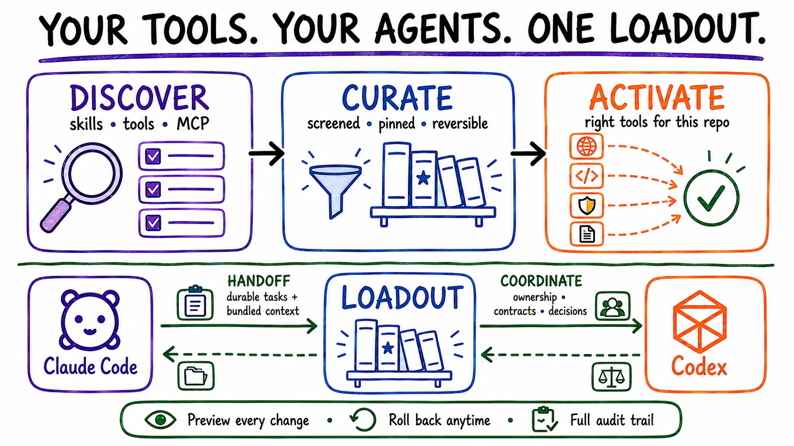

<h1 align="center">Loadout</h1>

<p align="center"><strong>Manage skills for 12 coding agents. Hand off and coordinate work between Claude Code and Codex.</strong></p>

<p align="center">
  
</p>

<p align="center">
  <a href="https://github.com/VirajMishra1/loadout/actions/workflows/ci.yml"></a>
  <a href="https://www.npmjs.com/package/loadout-ai"></a>
  <a href="https://www.npmjs.com/package/loadout-ai"></a>
  <a href="https://github.com/VirajMishra1/loadout"></a>
  <a href="./package.json"></a>
  <a href="./LICENSE"></a>
</p>

<p align="center">
  <a href="#try-it-in-30-seconds">Quick start</a> ·
  <a href="#use-claude-code-and-codex-together">Two agents</a> ·
  <a href="#try-these-prompts">Agent skills</a> ·
  <a href="#safety-and-trust">Safety</a> ·
  <a href="#command-reference">Commands</a>
</p>

## Try it in 30 seconds

You need Node.js 20 or newer and Git.

```bash
npm install --global loadout-ai
loadout setup --mode stable --details
```

The second command detects your coding agents and previews the 30-skill Stable
loadout. It does not change agent files. Review the plan, then apply it:

```bash
loadout setup --mode stable --yes --approve-risk
loadout status
```

Loadout saves a rollback snapshot before applying changes. Run
`loadout rollback` to restore the previous managed state.

`--approve-risk` acknowledges the instruction-like files reported by the current
Stable preview. Use it only after reading those findings; it does not replace the
preview or the pinned-source checks.

A later `--yes` invocation recomputes the plan from pinned sources and current agent and filesystem state; it does not persist or prove identity with the earlier preview.

## What Loadout does

| Capability     | What you get                                                          |
| -------------- | --------------------------------------------------------------------- |
| **Discover**   | Find skills, tools, and MCP servers worth reviewing                   |
| **Curate**     | Inspect, screen, and pin sources before trusting them                 |
| **Activate**   | Install a focused set for this repository across your agents          |
| **Handoff**    | Pass durable tasks with bundled context between Claude Code and Codex |
| **Coordinate** | Share file ownership, contracts, decisions, and acknowledgements      |

The package manager works across supported agents. Handoff and coordination are
currently designed for Claude Code and Codex working in the same repository.

## Use Claude Code and Codex together

### Handoff: pass a task that survives sessions

```bash
loadout handoff codex "write unit tests for auth" --bundle src/auth.ts src/types.ts --verify "tests pass" --verify-command npm --verify-args '["test"]'
```

Codex sees the task when it checks its inbox, works from the attached bounded
context, and marks it done. Claude Code can then read the result. Handoffs live
in an append-only project log, so restarting either agent does not erase them.
Bundles contain secret-redacted text and are capped at 50 KiB total; still
review them before committing and never attach credential files.

### Coordinate: work at the same time without stepping on files

```bash
loadout coord start --agents claude-code,codex       # preview ownership
loadout coord start --agents claude-code,codex --yes # apply ownership
loadout coord snapshot codex                         # inspect shared state
loadout coord discuss start "REST or GraphQL?" --agents claude-code,codex --rounds 2 --max-turns 5
```

Coordination is structured shared project state, not shared memory or a merged
context window. Events reach an agent at safe turn boundaries or when it checks
its snapshot; Loadout does not interrupt a turn in progress.

### Let Claude and Codex debate one decision

You prompt once and Loadout calls both providers in bounded turns—propose,
critique, synthesize—then records the decision. Neither agent can inject into
the other's in-progress turn; events arrive at safe turn boundaries. Each
round consumes paid provider turns from your configured Claude and Codex quota.
The bounded design discussion reports its turn budget before it starts.

See the [live coordination guide](./docs/LIVE_COLLABORATION.md) for ownership,
contracts, acknowledgements, discussions, the local dashboard, and limitations.

## Try these prompts

Install Loadout's two first-party skills once so your agent knows the workflow:

```bash
loadout skills install loadout-handoff --yes
loadout skills install loadout-curator --yes
```

Then ask naturally:

> _"Hand the test writing to Codex."_
>
> _"What did Codex leave for me?"_
>
> _"Which skills should be active for this repo?"_

The curator helps choose a focused active set; the handoff skill manages inboxes
and coordination without making you relay every command.

## Install and choose your agent

For a reproducible install, pin the current release:

```bash
npm install --global loadout-ai@0.9.4
loadout setup --mode stable --details
loadout setup --mode stable --yes --approve-risk
loadout status
```

Stable is the recommended starting point: 30 selected skill directories from
four pinned public sources. Loadout auto-detects supported agents; use
`--agents` when you want to narrow the destination.

If anything fails, follow the [user test guide](./docs/USER_TEST_GUIDE.md).
For profiles, per-agent paths, MCP configuration, and advanced commands, use the
[full reference](./docs/REFERENCE.md).

## Safety and trust

**Choose -> Inspect -> Preview -> Apply -> Undo**

- Preview is the default for setup, updates, and removal.
- Every managed apply creates a rollback snapshot first.
- Catalog sources are pinned and technically inspected, not declared safe or useful by fiat.
- Static inspection reports scripts, hooks, binaries, domains, credential references, and unsupported components; it is not a security audit.
- Project recommendations read bounded local metadata. The documented local flow does not upload project source.
- MCP servers and executable tools stay behind separate preview, permission, and setup steps.
- Shared manifests store environment-variable or OS-keychain references, not secret values.

<!-- loadout:current-limits:start -->

- All catalog records have identified SPDX licenses. See the [recorded license decisions](./docs/UPSTREAM_LICENSE_DECISIONS.md) for the source-by-source record.

<!-- loadout:current-limits:end -->

Read the [security policy](./SECURITY.md), [catalog policy](./docs/CATALOG_POLICY.md),
and [credential and update policy](./docs/CREDENTIAL_AND_UPDATE_POLICY.md) before
trusting third-party content.

## Demo

<p align="center">
  <a href="https://www.youtube.com/watch?v=opNqJKX7xMw">
    
  </a>
</p>

**[Watch the 72-second Loadout demo on YouTube](https://www.youtube.com/watch?v=opNqJKX7xMw).**

## Why Loadout

Loadout started with a frustrating question: **why does improving an AI coding agent
still mean opening twenty GitHub tabs?**

Useful skills, plugins, MCP servers, and settings arrive one experiment at a time.
Soon it is hard to remember what is installed, where it came from, whether something
better launched yesterday, or how to undo a change. The name comes from games, where
your loadout is the set of tools you choose for the mission. This does the same for AI
coding agents without making you rebuild the setup for every agent and every project.

Most extension tools begin with a repo you already know. Loadout begins one step
earlier: **what is actually worth knowing?** It stays with you after installation.

Some tools distribute agent configuration. Others share memory or coordinate
running agents. Loadout connects the whole lifecycle: discover and inspect what is
worth using, activate it reversibly across agents, then hand work off or coordinate
structured project facts when Claude Code and Codex work together.

Everything on this page is enforced. `docs/evidence/readme-claims.json` records
each material claim with the code or command that proves it, and CI fails the
build when the README and the implementation disagree—including the pinned
version in the install line above.

Loadout watches a much wider catalog than it activates. You can keep thousands of
technically screened skill copies in the disabled Maximum library, discover new projects as
they appear, and let each codebase pull a focused active set instead of dumping
everything into every prompt.

| The usual workflow                                             | The Loadout workflow                                             |
| -------------------------------------------------------------- | ---------------------------------------------------------------- |
| Find recommendations across feeds and bookmarks                | Watch one growing discovery catalog                              |
| Open every repo and guess whether to trust it                  | Inspect pinned sources, licenses, components, and risk findings  |
| Copy skills separately into Claude, Codex, Cursor, and friends | Apply one reviewed selection across detected agents              |
| Let every skill compete for context forever                    | Keep a bounded daily set or activate skills for this project     |
| Hope updates do not break anything                             | Preview updates and protect every managed change with a snapshot |
| Manually remember what was changed                             | Scan, reconcile, remove, roll back, or completely uninstall      |

Loadout is local, open source, and preview-first. It does not need an LLM API key
to manage skills.

## Profiles

| Mode      | Sources               | Skills | Active by default              |
| --------- | --------------------- | ------ | ------------------------------ |
| `stable`  | 4                     | 30     | yes—recommended starting point |
| `power`   | 8                     | 56     | yes                            |
| `maximum` | all reviewed          | all    | **no—downloaded but disabled** |
| `custom`  | your `--package` list | varies | yes                            |

Maximum downloads the reviewed library and leaves every skill disabled. Nothing
reaches an agent prompt until a project activates what it needs. See the
[full reference](./docs/REFERENCE.md) for source lists and custom configuration.

## Catalog and discovery

Discovery is separate from trust and installation. A popular new repository can
enter the review queue without being installed or promoted automatically.

```bash
loadout discover --source all --queue
loadout review-queue
loadout candidate inspect owner/repository
```

<!-- loadout:catalog-coverage:start -->

The bundled catalog currently contains **53 credited public repositories** across **39 categories**: **34 have skill components** and **19 are MCP-only**. All 53 are technically screened and pinned; 4 sources are selected by the bounded Stable policy. See every linked source, license status, component type, and pinned commit in **[Catalog and upstream credits](./docs/CATALOG.md)**.

<!-- loadout:catalog-coverage:end -->

<!-- loadout:evidence-stages:start -->

Catalog maturity: **53 sourced**, **53 technically inspected**, and **4 selected for Stable**. Independent human-review attestations and signed comparative benchmarks are not yet published, so Loadout does not pretend static inspection proves usefulness. The pinned catalog remains usable today, and local outcomes can be recorded to improve later rankings. Definitions and promotion rules are in the [catalog policy](./docs/CATALOG_POLICY.md).

<!-- loadout:evidence-stages:end -->

<!-- loadout:daily-discovery:start -->

**Discovery snapshot (generated 2026-09-08):** [237 repositories observed](./docs/DISCOVERED.md), including 221 uncataloged review candidates and 16 repositories already in the inspected catalog.
<!-- loadout:daily-discovery:end -->

## Agent support

<!-- loadout:support-summary:start -->

Loadout's adapter capability matrix currently covers **12 agents**: Claude Code, Cline, Codex, Cursor, Gemini CLI, GitHub Copilot, Hermes, Junie, Kiro CLI, OpenCode, Roo Code, Windsurf. See the [complete feature matrix](./docs/FEATURE_TEST_MATRIX.md) for configured paths, filesystem lifecycle, platform, and native-host evidence.

`tests/adapter-conformance.test.ts` plans, applies, inspects, disables, re-enables, and rolls back one skill for every configured target when the suite runs. A configured target path does not prove that the native application recognizes or executes it. Native application execution is not inferred from filesystem simulation.

Configured platform evidence: Linux (CI configured), macOS (CI configured), Windows (CI configured).

Platform evidence source: `.github/workflows/ci.yml (cross-platform job)`.

Configured CI platforms describe a manually triggered workflow, not evidence that a current run passed.

<!-- loadout:support-summary:end -->

## Command reference

| Goal                               | Command                                                                            |
| ---------------------------------- | ---------------------------------------------------------------------------------- |
| Guided first run                   | `loadout guide`                                                                    |
| Preview or apply Stable            | `loadout setup --mode stable --details` · then `--yes --approve-risk` after review |
| Inspect managed skills             | `loadout status` · `loadout library`                                               |
| Recommend for this repository      | `loadout recommend --project .`                                                    |
| Activate a project-specific set    | `loadout optimize --project . --limit 30`                                          |
| Scan or update                     | `loadout scan` · `loadout update`                                                  |
| Send a task                        | `loadout handoff codex "write tests"`                                              |
| Use a handoff template             | `loadout handoff codex src/auth.ts --template write-tests`                         |
| Preview two-agent ownership        | `loadout coord start --agents claude-code,codex`                                   |
| Inspect coordination state         | `loadout coord snapshot codex`                                                     |
| Detect shared contract candidates  | `loadout coord detect`                                                             |
| Turn a decision into tasks         | `loadout coord discuss implement <thread-id>`                                      |
| Start the coordination MCP server  | `loadout serve`                                                                    |
| Health check                       | `loadout doctor`                                                                   |
| Restore the previous managed state | `loadout rollback`                                                                 |
| Preview complete removal           | `loadout uninstall`                                                                |
| Full CLI reference                 | `loadout --help` · `loadout advanced`                                              |

Most mutating commands are previews first. Add `--yes` only after reviewing the plan.

## Development

```bash
npm ci
npm run verify
npm run verify:full
```

<!-- loadout:verification-summary:start -->

`verify` invokes `format:check`, `lint`, `typecheck`, `check:audit`, `check:evidence`, `test`, `test:e2e:cli`, `test:e2e:readme`, `test:e2e:coordination`, `test:package`, `test:performance` in that order. `verify:full` runs that gate and the coverage suite.

<!-- loadout:verification-summary:end -->

The [testing guide](./docs/TESTING.md) documents each check and its boundary.

## Documentation

- [Full CLI and profile reference](./docs/REFERENCE.md)
- [User test guide](./docs/USER_TEST_GUIDE.md)
- [Live Claude Code ↔ Codex coordination](./docs/LIVE_COLLABORATION.md)
- [Catalog and upstream credits](./docs/CATALOG.md)
- [Catalog evidence policy](./docs/CATALOG_POLICY.md)
- [Feature and evidence matrix](./docs/FEATURE_TEST_MATRIX.md)
- [Testing contract](./docs/TESTING.md)
- [Changelog](./CHANGELOG.md)

## Contributing, security, and attribution

See [CONTRIBUTING.md](./CONTRIBUTING.md) · [Code of Conduct](./CODE_OF_CONDUCT.md) ·
Report vulnerabilities through [SECURITY.md](./SECURITY.md), without credentials,
private source, or unredacted state. General bugs and proposals belong in the
[issue tracker](https://github.com/VirajMishra1/loadout/issues).

The catalog contains 53 credited public repositories. Inclusion records discovery
and attribution; it does not transfer ownership, imply endorsement, or relicense
upstream work.

## License

Loadout is licensed under the [MIT License](./LICENSE). Catalog entries retain
their upstream licenses and terms.
