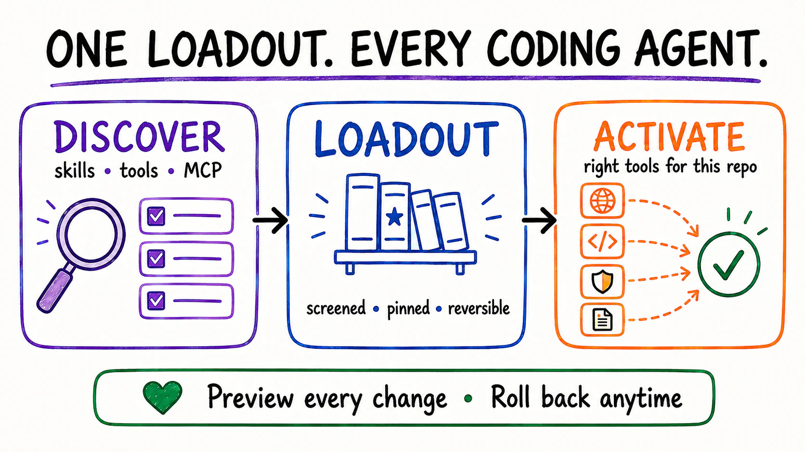
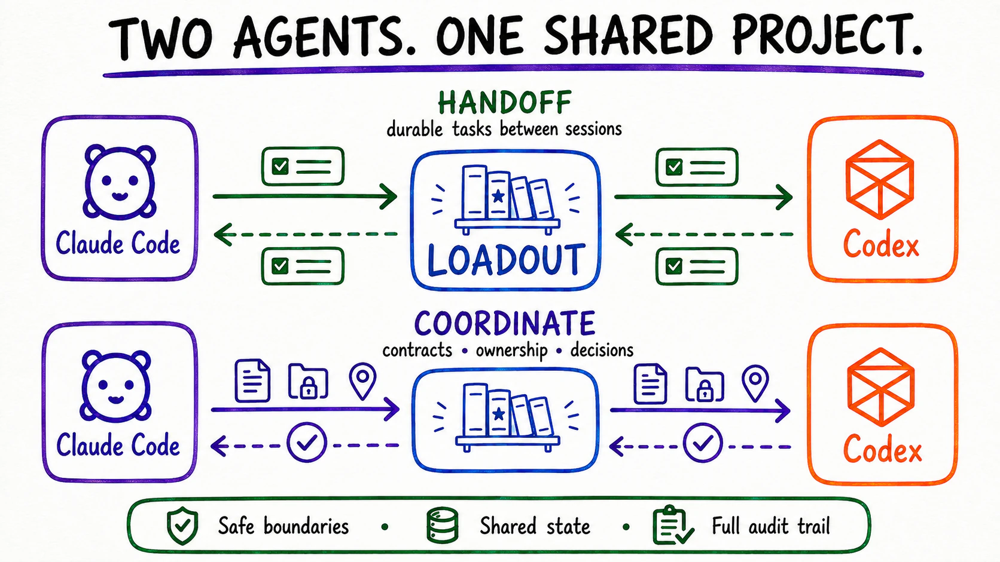

<p align="center">
  
</p>

<h1 align="center">Loadout</h1>

<p align="center"><strong>Agent extensions, under control.</strong></p>

<p align="center">
  <strong>The package manager for your AI coding setup.</strong><br>
  Find skills worth having, activate the right ones per project,<br>
  install them across 12 agents, hand work from Claude Code to Codex,<br>
  and undo any of it.
</p>

<p align="center">
  <a href="https://github.com/VirajMishra1/loadout/actions/workflows/ci.yml"></a>
  <a href="https://www.npmjs.com/package/loadout-ai"></a>
  <a href="https://www.npmjs.com/package/loadout-ai"></a>
  <a href="https://github.com/VirajMishra1/loadout"></a>
  <a href="./package.json"></a>
  <a href="./LICENSE"></a>
</p>

<p align="center">
  <a href="#what-it-looks-like">See it</a> ·
  <a href="#install">Install</a> ·
  <a href="#use-it-from-inside-your-agent">Use it in your agent</a> ·
  <a href="#passing-work-between-two-agents">Two agents</a> ·
  <a href="#why-loadout">Why</a> ·
  <a href="#command-reference">Commands</a>
</p>

## What it looks like

```console
$ loadout doctor
loadout doctor — HEALTHY

Platform:   darwin
State:      ~/.loadout ✓ writable
Agents:     3 detected, 9 available

DETECTED AGENTS
  ✓ Claude Code
    ~/.claude/skills
    43 skills | supports: skill, command, agent, mcp, plugin, root
  ✓ Codex
    ~/.agents/skills
    30 skills | supports: skill, command, agent, mcp, plugin, root

$ loadout recommend --project .
Project: checkout-service
Detected: TypeScript, Zod, Vitest, next.js, react

Rule-based project suggestions:
  superpowers [high, skill library] — Useful engineering planning, testing, and review workflows.
  context7 [high, skill library] — Current library documentation helps agents avoid outdated APIs.
  ui-ux-pro-max [high, skill library] — Frontend framework detected: next.js, react.
  playwright-mcp [medium, MCP/runtime setup] — Browser verification may help test the detected frontend.
```

It reads your repository rather than a config file, knows which agents you
actually have, and previews and snapshots every write before it touches them.

### Demo

<p align="center">
  <a href="https://www.youtube.com/watch?v=opNqJKX7xMw">
    
  </a>
</p>

**[Watch the 72-second Loadout demo on YouTube](https://www.youtube.com/watch?v=opNqJKX7xMw).**

## Install

You need Node.js 20 or newer and Git.

```bash
npm install --global loadout-ai
loadout setup --mode stable
```

The second command detects your agents and previews the 30-skill Stable loadout.
Nothing changes until you approve it. If anything goes wrong, start with the
[user test guide](./docs/USER_TEST_GUIDE.md).

For a reproducible install, pin the release: `npm install --global loadout-ai@0.9.0`.

## Use it from inside your agent

A CLI you have to leave your agent to run is a context switch. Loadout ships two
skills so you do not have to: one for agent handoffs and one for choosing a
focused skill set for the current repository.

```bash
loadout skills install loadout-handoff --yes
loadout skills install loadout-curator --yes
```

Start a new agent session and just ask, in the conversation you are already in:

> _"Hand the test writing to Codex."_
> _"What did Codex leave for me?"_
> _"Which skills should be active for this repo?"_

The skills teach your agent to call `loadout` and act on the results, so it
checks its own inbox at the start of a session and can pass work to your other
agent without you relaying it by hand.

`loadout skills list` shows what ships with Loadout and what is already installed.

## Passing work between two agents

<p align="center">
  
</p>

If you pay for both Claude and a ChatGPT plan, the two agents cannot see each
other. Loadout gives them a shared, append-only task log:

```bash
loadout handoff codex "write unit tests for auth" --context "see src/auth.ts"
```

That is the whole thing. The first send creates the log and adds a short managed
block to `CLAUDE.md` and `AGENTS.md` telling each agent to check its inbox at the
start of a session. Only the text between the `loadout:handoff` markers is
managed; the rest of your file is left alone.

```bash
loadout handoff codex      # what is waiting for codex
loadout handoff            # everything pending, both directions
loadout handoff --done 4f2a1c
```

### Make Claude Code and Codex coordinate live (beta)

Live coordination adds file ownership, versioned contracts, decisions, and
acknowledgements over a shared project event stream — not a merged context
window. See the [live coordination guide](./docs/LIVE_COLLABORATION.md).

```bash
loadout coord own claude-code src/api
loadout coord contract checkout-api --agent claude-code \
  --body "POST /api/checkout -> 201 { id: string }"
loadout coord snapshot codex            # what codex needs to know
loadout coord replay                    # full timeline as a story
```

`loadout serve` exposes the same operations as MCP tools for both hosts.
The optional provider bridge (`loadout coord agents bridge`) resumes sessions
and delivers events at safe turn boundaries — never mid-turn.

Start a bounded design discussion to have both agents challenge an approach
before either writes code. Two rounds plus synthesis = five provider turns:

```bash
loadout coord discuss start "REST or GraphQL for checkout?" \
  --agents claude-code,codex --rounds 2 --max-turns 5
```

Each response is explicitly public, linked to the previous response, and saved
in the project audit trail. The discussion prompt forbids edits and tool use;
review the final decision, then choose whether to implement it. Existing
sessions work with `--sessions claude-code:<id> codex:<id>`.

## How it works

**Choose -> Inspect -> Preview -> Apply -> Undo**

1. **Choose** Stable, Power, Maximum, or your own package list.
2. **Inspect** where each extension comes from and what it can do.
3. **Preview** every planned change without changing agent files.
4. **Apply** with `--yes`; Loadout saves a rollback snapshot first.
5. **Undo** with `loadout rollback` if you change your mind.

### Abridged terminal transcript

This is an explicitly abridged transcript from a disposable Stable run. A literal `…` marks omitted fetch output; `<snapshot-id>` is a variable placeholder because snapshot IDs vary. Loadout auto-detects installed agents; `--agents` narrows the selection when needed.

```console
$ loadout setup --mode stable
…
Loadout: Stable
Detected agents: Claude Code, Cursor, Codex
Catalog selection: 4 repositories
Ready to install: 4 skill repositories (30 agent skill directories)
Preview complete; nothing was changed. Re-run with --yes to install this exact screened plan.

$ loadout setup --mode stable --yes
…
Loadout installed 4 repositories for 3 agent(s). Snapshot: <snapshot-id>

$ loadout rollback
Restored snapshot <snapshot-id>

$ loadout handoff codex "write tests for the auth module" --context "zod schemas exist"
  created .handoff/
  told codex to check its inbox
Sent to codex: write tests for the auth module

$ loadout doctor
loadout doctor — HEALTHY
Platform:   darwin
State:      ~/.loadout ✓ writable
Agents:     3 detected, 9 available
```

The final preview sentence above is captured CLI wording. A later `--yes` invocation recomputes the plan from pinned sources and current agent and filesystem state; it does not persist or prove identity with the earlier preview.

Preview may fill Loadout's private download cache, but it does not change your agent
files. Review the summary and warnings before approving an apply command.

## Why Loadout

Loadout started with a frustrating question: **why does improving an AI coding agent
still mean opening twenty GitHub tabs?**

Useful skills, plugins, MCP servers, and settings arrive one experiment at a time.
Soon it is hard to remember what is installed, where it came from, whether something
better launched yesterday, or how to undo a change. The name comes from games, where
your loadout is the set of tools you choose for the mission. This does the same for AI
coding agents without making you rebuild the setup for every agent and every project.

Most extension tools begin with a repo you already know. Loadout begins one step
earlier: **what is actually worth knowing?** It stays with you after installation.

Some tools distribute agent configuration. Others share memory or coordinate
running agents. Loadout connects the whole lifecycle: discover and inspect what is
worth using, activate it reversibly across agents, then hand work off or coordinate
structured project facts when Claude Code and Codex work together.

Everything on this page is enforced. `docs/evidence/readme-claims.json` records
each material claim with the code or command that proves it, and CI fails the
build when the README and the implementation disagree — including the pinned
version in the install line above.

Loadout watches a much wider catalog than it activates. You can keep thousands of
technically screened skill copies in the disabled Maximum library, discover new projects as
they appear, and let each codebase pull a focused active set instead of dumping
everything into every prompt.

| The usual workflow                                             | The Loadout workflow                                             |
| -------------------------------------------------------------- | ---------------------------------------------------------------- |
| Find recommendations across feeds and bookmarks                | Watch one growing discovery catalog                              |
| Open every repo and guess whether to trust it                  | Inspect pinned sources, licenses, components, and risk findings  |
| Copy skills separately into Claude, Codex, Cursor, and friends | Apply one reviewed selection across detected agents              |
| Let every skill compete for context forever                    | Keep a bounded daily set or activate skills for this project     |
| Hope updates do not break anything                             | Preview updates and protect every managed change with a snapshot |
| Manually remember what was changed                             | Scan, reconcile, remove, roll back, or completely uninstall      |

Loadout is local, open source, and preview-first. It does not need an LLM API key
to manage skills. MCP servers and executable tools stay behind their own explicit
setup and permission steps.

## Stable workflow

### Stable: install the essentials and start building

Stable is the recommended daily driver: **30 selected skill directories from four
pinned public sources**, installed into each agent you choose.

```bash
loadout setup --mode stable
loadout setup --mode stable --yes
loadout status
loadout scan
loadout rollback
```

Stable is Loadout's strongest general starting point, not a claim that one setup is
best for every person or project.

## Profiles

| Mode      | Sources               | Skills | Active by default                |
| --------- | --------------------- | ------ | -------------------------------- |
| `stable`  | 4                     | 30     | yes — recommended starting point |
| `power`   | 8                     | 56     | yes                              |
| `maximum` | all reviewed          | all    | **no — downloaded but disabled** |
| `custom`  | your `--package` list | varies | yes                              |

**Maximum** downloads the entire reviewed library and leaves every skill _disabled_.
Nothing reaches an agent prompt until a project activates what it needs.

For detailed profile tables, source lists, and custom configuration, see the
**[full reference](./docs/REFERENCE.md)**.

## Catalog and discovery

The catalog is not a frozen list. Loadout separates **discovery** from
**installation** so a viral repo can be noticed quickly without being trusted
blindly.

```bash
loadout discover --source all --queue
loadout review-queue
loadout candidate inspect owner/repository
loadout update
```

<!-- loadout:catalog-coverage:start -->

The bundled catalog currently contains **53 credited public repositories** across **39 categories**: **34 have skill components** and **19 are MCP-only**. All 53 are technically screened and pinned; 4 sources are selected by the bounded Stable policy. See every linked source, license status, component type, and pinned commit in **[Catalog and upstream credits](./docs/CATALOG.md)**.

<!-- loadout:catalog-coverage:end -->

<!-- loadout:evidence-stages:start -->

Catalog maturity: **53 sourced**, **53 technically inspected**, and **4 selected for Stable**. Independent human-review attestations and signed comparative benchmarks are not yet published, so Loadout does not pretend static inspection proves usefulness. The pinned catalog remains usable today, and local outcomes can be recorded to improve later rankings. Definitions and promotion rules are in the [catalog policy](./docs/CATALOG_POLICY.md).

<!-- loadout:evidence-stages:end -->

<!-- loadout:daily-discovery:start -->

**Discovery snapshot (generated 2026-09-04):** [239 repositories observed](./docs/DISCOVERED.md), including 222 uncataloged review candidates and 17 repositories already in the inspected catalog.
<!-- loadout:daily-discovery:end -->

## Trust and limits

- A pinned commit identifies source bytes; it does not prove safety, correct licensing, usefulness, or future compatibility.
- Static inspection reports scripts, hooks, binaries, domains, credential references, and unsupported components. It is not a security audit.
- No bundled source is called proven until human review and recorded local outcomes support it.
- Project recommendations read bounded local metadata. The documented local flow does not upload project source.
- MCP servers and executable tools have separate preview and approval paths.
- Shared manifests hold environment-variable or OS-keychain references, not secret values.

<!-- loadout:current-limits:start -->

- All catalog records have identified SPDX licenses. See the [recorded license decisions](./docs/UPSTREAM_LICENSE_DECISIONS.md) for the source-by-source record.

<!-- loadout:current-limits:end -->

Read the [security policy](./SECURITY.md), [catalog policy](./docs/CATALOG_POLICY.md), and [credential and update policy](./docs/CREDENTIAL_AND_UPDATE_POLICY.md) before trusting third-party content.

## Agent support

<!-- loadout:support-summary:start -->

Loadout's adapter capability matrix currently covers **12 agents**: Claude Code, Cline, Codex, Cursor, Gemini CLI, GitHub Copilot, Hermes, Junie, Kiro CLI, OpenCode, Roo Code, Windsurf. See the [complete feature matrix](./docs/FEATURE_TEST_MATRIX.md) for configured paths, filesystem lifecycle, platform, and native-host evidence.

`tests/adapter-conformance.test.ts` plans, applies, inspects, disables, re-enables, and rolls back one skill for every configured target when the suite runs. A configured target path does not prove that the native application recognizes or executes it. Native application execution is not inferred from filesystem simulation.

Configured platform evidence: Linux (CI configured), macOS (CI configured), Windows (CI configured).

Platform evidence source: `.github/workflows/ci.yml (cross-platform job)`.

Configured CI platforms describe a manually triggered workflow, not evidence that a current run passed.

<!-- loadout:support-summary:end -->

## Command reference

| What it does                            | Command                                        |
| --------------------------------------- | ---------------------------------------------- |
| Beginner-friendly guided path           | `loadout guide`                                |
| Preview the 30-skill Stable setup       | `loadout setup --mode stable`                  |
| Apply after reviewing the preview       | `loadout setup --mode stable --yes`            |
| Show managed packages and active skills | `loadout status` · `loadout library`           |
| What fits this repository               | `loadout recommend --project .`                |
| Project-specific active set             | `loadout optimize --project . --limit 30`      |
| Scan existing skills across agents      | `loadout scan`                                 |
| Check for source updates                | `loadout update`                               |
| Find newly launched candidates          | `loadout discover --source all --queue`        |
| Install Loadout's own skill             | `loadout skills install loadout-handoff --yes` |
| Send a task to another agent            | `loadout handoff codex "write tests"`          |
| Inspect shared agent state              | `loadout coord snapshot codex`                 |
| Detect live provider runtimes           | `loadout coord agents detect`                  |
| Debate one design with both providers   | `loadout coord discuss start "<topic>" ...`    |
| Start the coordination MCP server       | `loadout serve`                                |
| Agent health check                      | `loadout doctor`                               |
| Rollback the latest managed change      | `loadout rollback`                             |
| Preview complete removal                | `loadout uninstall`                            |
| Full CLI reference                      | `loadout --help` · `loadout advanced`          |

Most mutating commands are dry runs first. Add `--yes` to apply.

## Built with Claude and Codex

Loadout was designed and built by [Viraj Mishra](https://github.com/VirajMishra1) with Claude Code and Codex.

Loadout's core skill management does **not** call an LLM API or require an LLM API
key. The opt-in provider bridge and design room do invoke your configured
Claude/Codex sessions and spend their quota; neither is a hidden requirement for
discovering, installing, or rolling back extensions.

## Development

```bash
npm ci
npm run verify
npm run verify:full
```

<!-- loadout:verification-summary:start -->

`verify` invokes `format:check`, `lint`, `typecheck`, `check:audit`, `check:evidence`, `test`, `test:e2e:cli`, `test:e2e:readme`, `test:package`, `test:performance` in that order. `verify:full` runs that gate and the coverage suite.

<!-- loadout:verification-summary:end -->

The [testing guide](./docs/TESTING.md) documents the exact checks and their boundaries.

## Documentation

- [Full reference (profiles, MCP, discovery, tools)](./docs/REFERENCE.md)
- [Catalog and upstream credits](./docs/CATALOG.md)
- [Catalog evidence policy](./docs/CATALOG_POLICY.md)
- [Feature and evidence matrix](./docs/FEATURE_TEST_MATRIX.md)
- [Testing contract](./docs/TESTING.md)
- [User test guide](./docs/USER_TEST_GUIDE.md)
- [Live Codex ↔ Claude collaboration design](./docs/LIVE_COLLABORATION.md)
- [Changelog](./CHANGELOG.md)

## Contributing, security, and attribution

See [CONTRIBUTING.md](./CONTRIBUTING.md) · [Code of Conduct](./CODE_OF_CONDUCT.md) · Report vulnerabilities through [SECURITY.md](./SECURITY.md), without credentials, private source, or unredacted state. General bugs and proposals belong in the [issue tracker](https://github.com/VirajMishra1/loadout/issues).

The catalog contains 53 credited public repositories. Inclusion records discovery and attribution; it does not transfer ownership, imply endorsement, or relicense upstream work.

## License

Loadout is licensed under the [MIT License](./LICENSE). Catalog entries retain their upstream licenses and terms.
