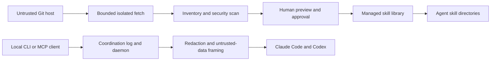

# Loadout threat model

## Executive summary

Loadout is a local-first CLI that discovers, reviews, installs, and activates
third-party agent skills and coordinates work between local coding agents. Its
highest-impact risk is supply-chain prompt injection: content copied into an
agent's skill directory may later influence an agent that can read source code,
run tools, and modify files.

The current implementation has meaningful defense in depth: immutable catalog
commit pins, bounded and isolated Git fetches, deterministic content scanning,
preview-first mutation, atomic writes, snapshots and rollback, catalog-drift
warnings, strict coordination schemas, secret redaction, loopback-only daemon
binding, bearer authentication, bounded provider turns, and a kill switch.
These controls reduce risk; they do not make third-party instructions inherently
safe. Users still need to review new or changed skills before activation.

## Scope and assumptions

In scope:

- Catalog, repository-fetch, inspection, install, activation, update, snapshot,
  and rollback paths under `src/core/catalog/`, `src/core/install/`, and
  `src/core/workspace/`.
- Handoff and context-bundle paths under `src/core/delegation/`.
- Coordination log, MCP server, daemon, dashboard, discussion, and provider
  adapters under `src/core/coordination/`.

Out of scope:

- Vulnerabilities in npm, Git, Claude Code, Codex, or another supported agent.
- An attacker who already has arbitrary code execution as the same OS user.
- CI/CD and maintainer-account compromise, except where they affect the package
  or catalog supply chain.

Assumptions:

- Loadout runs without elevated privileges.
- The user trusts the installed `loadout-ai` package and its transitive runtime
  dependencies.
- Catalog changes receive human review before release.
- Provider sessions may receive sensitive repository context, subject to each
  provider's own security and data policies.

## System and trust boundaries

| Boundary                               | Data crossing it                         | Principal controls                                                                                   |
| -------------------------------------- | ---------------------------------------- | ---------------------------------------------------------------------------------------------------- |
| npm registry → local CLI               | Package and dependencies                 | npm integrity metadata, release verification                                                         |
| Git host → repository cache            | Untrusted repository tree                | HTTPS/SSH-only URL policy, isolated Git config, no hooks or credential helper, time/file/byte bounds |
| Repository cache → skill library       | Instructions, scripts, manifests, assets | Schema checks, deterministic security scan, preview and approval, atomic transaction                 |
| Skill library → active agent directory | Reviewed skill files                     | Managed-target checks, collision detection, snapshot and rollback                                    |
| Local client → coordination daemon     | Events and control requests              | `127.0.0.1` binding, bearer token, strict schemas, bounded bodies                                    |
| Coordination log → agent prompt        | Untrusted events, contracts, decisions   | Untrusted-data framing, secret redaction, size limits, bounded turns, kill switch                    |
| Loadout → provider CLI/SDK             | Prompts and cancellation signals         | Argument arrays / SDK calls, no shell, native cancellation and timeouts                              |

## Assets and security objectives

| Asset                                | Objective                                                                |
| ------------------------------------ | ------------------------------------------------------------------------ |
| Active agent instructions            | Prevent unreviewed or altered content from becoming trusted instructions |
| User repository and credentials      | Prevent exfiltration, unintended writes, and credential disclosure       |
| Catalog provenance and reviewed pins | Detect substitution and unreviewed upstream drift                        |
| Install state and snapshots          | Preserve atomicity, recoverability, and accurate ownership               |
| Handoff bundles and coordination log | Preserve integrity while treating their content as untrusted data        |
| Provider budget and sessions         | Prevent unbounded, overlapping, or uncancellable paid turns              |

## Attacker model

- A malicious or compromised skill repository can contain adversarial Markdown,
  executable files, dependencies, Unicode controls, remote instructions, or
  misleading metadata.
- A compromised upstream can move its default branch after a reviewed catalog
  commit was published.
- A malicious local webpage or unrelated local process can attempt requests to a
  loopback coordination service.
- A collaborator able to edit `.handoff/` can forge or corrupt coordination data.
- A repository can attempt resource exhaustion with size, file-count, depth, or
  pathological Git objects.

A process already running arbitrary code as the same OS user can usually edit the
same project and agent configuration directly. The daemon token is therefore a
boundary against unrelated loopback clients, not a privilege boundary against a
fully compromised user account.

## Threats and controls

| ID     | Threat                                                   | Impact | Current controls                                                                                                                                                                                                                      | Residual risk / next control                                                                                                                                               |
| ------ | -------------------------------------------------------- | ------ | ------------------------------------------------------------------------------------------------------------------------------------------------------------------------------------------------------------------------------------- | -------------------------------------------------------------------------------------------------------------------------------------------------------------------------- |
| TM-001 | Prompt injection or exfiltration instructions in a skill | High   | Deterministic scanner flags prompt override, exfiltration, remote instructions, Unicode controls, executable files, dependencies, domains, and environment names; findings are previewed before approval                              | Heuristics cannot understand every obfuscation or semantic attack. Keep human review mandatory for blocking findings and expand adversarial fixtures as bypasses are found |
| TM-002 | Upstream content changes after catalog review            | High   | Catalog entries use full commit SHAs; installs fetch the exact commit; updates compare upstream HEAD against every reviewed pin for that repository and mark unreviewed drift as blocking                                             | Maintainer or release-account compromise can still replace catalog data/package artifacts. Add signed release provenance and documented catalog-review policy              |
| TM-003 | Repository-fetch resource exhaustion                     | Medium | Default timeout, byte cap, file cap, GitHub tree preflight, post-clone bounds, shallow fetch, disabled hooks/templates/LFS smudge, isolated Git config                                                                                | Generic Git hosts cannot be measured before clone; Git metadata and filesystem edge cases can still consume resources. Consider a subprocess disk quota or sandbox         |
| TM-004 | Path traversal, symlink escape, or unsafe overwrite      | High   | Adapter-derived destinations, inside-root checks, collision/occupancy detection, drift checks, atomic transactions, snapshot path validation; handoff bundles explicitly reject traversal, symlinks, internal paths, and binary files | New write paths can regress. Keep boundary tests for every feature that writes outside `.handoff/`                                                                         |
| TM-005 | Credential leakage through a Git URL or subprocess       | High   | Generic Git accepts only HTTPS or SSH/scp forms, rejects embedded HTTPS credentials, query strings, fragments, option-like inputs, and uses `execFile` argument arrays with an isolated credential-helper configuration               | SSH agent and host configuration remain outside Loadout's control. Avoid echoing raw upstream errors that may contain environment-specific details                         |
| TM-006 | Forged coordination events influence an agent            | Medium | Strict event schemas, monotonic sequencing, corruption reporting, secret redaction, untrusted-data prompt framing, bounded snapshots, provider turn budgets, timeouts, and kill switch                                                | Events are not cryptographically attributable to agents. Optional per-agent signing would help teams that do not fully trust every local writer                            |
| TM-007 | Localhost daemon request forgery                         | Medium | Loopback-only binding, owner-only bearer-token file, symlink checks, timing-safe token comparison, bounded request bodies                                                                                                             | Same-user compromise is not prevented. Browser-facing endpoints should retain origin/content-type defenses and never expose mutation without authorization                 |
| TM-008 | Secret disclosure in context bundles or logs             | High   | Canonical redaction, project-relative text-only bundles, 20-file/32-KiB-per-file/50-KiB-total bounds, `.git` and `.handoff` exclusions, owner-only atomic persistence                                                                 | Redaction is heuristic. Users must not bundle credential stores or secrets; add detectors when new credential formats are observed                                         |
| TM-009 | Paid provider turn continues after timeout/cancel        | Medium | Claude subprocess receives `AbortSignal`; Codex SDK receives native `AbortSignal`; configured timeout and caller cancellation are combined; busy state releases after settlement                                                      | Provider-side billing semantics are external. Keep adapter contract tests aligned with installed provider SDK versions                                                     |
| TM-010 | Snapshot or rollback cannot restore a valid tree         | Medium | Snapshot schema validation, atomic mutations, file-mode capture, files restored before read-only directory modes, rollback verification                                                                                               | Platform permission semantics differ, especially on Windows. Maintain cross-platform CI and recovery tests                                                                 |

## Verified security properties

- Catalog GitHub sources resolve to `owner/repo` and exact 40-character commit
  hashes; reviewed commits are fetched detached rather than following a branch.
- Generic Git URLs are HTTPS or SSH only. Local paths, `file://`, plain HTTP,
  embedded HTTPS credentials, query strings, fragments, and option-like values
  are rejected before Git is invoked.
- Git runs without repository hooks, global/system Git config, credential helper,
  terminal prompts, or LFS smudge.
- Handoff logs retain valid entries when a corrupt line exists, and bundle
  references are schema-validated before reading or cleanup.
- Coordination data is framed as untrusted project data before provider delivery;
  it is not presented as a higher-priority instruction source.
- Provider discussion turns are sequential, explicitly budgeted, timeout-bound,
  cancellable, and stopped by the coordination kill switch.

## Security validation priorities

Before each public release:

1. Run the full cross-platform unit, integration, coverage, package, and evidence
   gates.
2. Exercise a malicious-skill corpus covering obfuscated prompt injection,
   symlink/path traversal, binary/oversized inputs, credential patterns, and
   Unicode controls.
3. Verify the packed npm tarball contains only intended runtime and documentation
   files and that its version matches the Git tag and release notes.
4. Confirm daemon mutation routes reject missing/invalid tokens and oversized or
   malformed bodies.
5. Run bounded provider-adapter smoke tests only with explicit budget approval;
   unit tests must remain provider-free.

## Residual-risk statement

Loadout reduces the chance that unreviewed or malformed third-party content is
silently activated, but it cannot prove an agent instruction is benign. The safe
operating model remains: preview changes, inspect provenance and security
findings, activate the smallest useful set, and keep rollback material until the
new loadout has been exercised.
